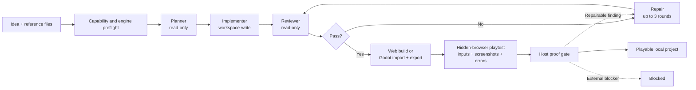
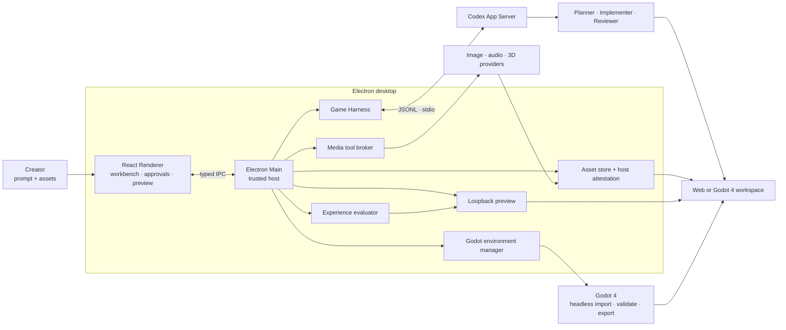

<p align="center">
  
</p>

<h1 align="center">Noobi.ai</h1>

<p align="center">
  <strong>Turn one game idea into a reviewed, playable Web or Godot game.</strong><br>
  A local-first desktop production agent powered by Codex App Server and Godot 4.
</p>

<p align="center">
  <a href="https://github.com/Innate-Labs/Noobi.ai/actions/workflows/ci.yml"></a>
  <a href="https://github.com/Innate-Labs/Noobi.ai/stargazers"></a>
  <a href="https://github.com/Innate-Labs/Noobi.ai/forks"></a>
  
  
</p>

<p align="center">
  <a href="#quick-start"><strong>Run from source</strong></a> ·
  <a href="#fork-and-customize"><strong>Fork &amp; customize</strong></a> ·
  <a href="docs/ARCHITECTURE.md"><strong>Architecture</strong></a> ·
  <a href="README.zh-CN.md"><strong>简体中文</strong></a>
</p>


Noobi.ai gives Codex a bounded game-production loop instead of asking one agent to improvise everything in a single pass. A read-only Planner scopes the work, an Implementer builds inside an isolated project directory, an independent Reviewer checks the result, and the host builds and plays the production output before completion. Failed review, build or playtest checks return to the same Implementer for up to three repair rounds.

> **Current status:** developer preview for macOS. No signed or notarized binary is published yet; run it from source. The output is a standalone Web or Godot 4 project in your own workspace.

### Choose a production plan first

Submitting a new idea or a change request now generates comparable plans before production starts. New games offer 2–3 routes; a small existing-project adjustment may offer one. Review the gameplay loop, scope, assumptions and delivery platform, then choose **Start with this plan**. Planning calls the configured model and consumes analysis quota; it does not implement the game or generate assets. Time and price remain unknown without measured evidence.

Plans are saved locally and can be reopened from the saved-plans menu. Retry/cancel planning without starting a game. The host binds a start to one immutable plan version and prevents duplicate production runs. Visual references are stored independently and remain available after restart; ordinary production attachments still need to be reattached. Use **Edit this plan** to change gameplay, camera, regions, characters, style, platform and scope constraints. Saved edits create a new version and automatically lock changed fields. Validate the edited plan before starting; contradictions block execution. Unlock a field before changing it again. You can also revise in natural language, combine routes, paste/import UTF-8 `.md` or `.txt` plans (up to 12,000 characters / 48 KB), and inspect version history. Existing-project plans retain prior requirements, explain affected systems/save assumptions/regression checks, and bind to the source revision. Use **Add game reference images** to import 1–5 PNG/JPEG/WebP images (12 MiB each, 32 MiB total, up to 16 million pixels). Assign style, character, layout or UI purposes. The planner receives actual images and separates visible facts, design inferences and unknowns. Correct the interpretation, then validate a new plan version before starting. Godot review images are copied and bound to the current build; a screenshot is not proof of working controls or hidden rules. Use **Add game clip** for one MP4/MOV (up to 200 MiB, 10 minutes, about 1080p), select 1–120 seconds, and extract time-stamped frames with local FFmpeg/ffprobe. Combine it with image references, inspect/edit the event timeline and rule hypotheses, then validate the adapted plan. No audio is analyzed; sampling can miss fast actions and never proves exact controls or hidden formulas. Identical new analysis requests reuse saved results only when model, instructions, requirements and input hashes match; explicit retry reruns the model.

For a stopped or failed project with a started plan, leave the input empty and choose **Continue production** to resume that plan. Entering a new request still opens planning. The **Production progress** panel saves pipeline steps, interruptions, failure reasons and earlier attempts locally. Restarting preserves these records and waits for you to continue. Completed planning and implementation turns can be reused only when the workspace and production settings match; reviews and delivery checks run again. Older projects acquire records on their next start or continuation. This is recovery at completed pipeline steps, not arbitrary tool-level resume, a game-completion percentage.

The progress panel also exposes each phase's prerequisites, selected requirement IDs and completion gate. Execution receipts preserve input/output source hashes, asset references and current frozen-build/report hashes. Repairs and re-reviews append separate dependency records; they never overwrite earlier findings. Changed source invalidates a read-only review or the next step's old evidence. Missing historical receipts remain explicitly unknown.

Each selected plan now retains an execution allowance across restarts: 40 model-turn reservations, 6 corrective passes (including core-loop and visual-sample work), and 6 host reconnections by default. Reservations are saved before dispatch and failed attempts still count. A single turn also stops after 6 host reconnections even if responses briefly resume. Repeating the same findings against unchanged source after a completed repair stops further repair. The progress panel shows the failure category, original error, suggested action, and cumulative counters. On a stopped or failed run you may explicitly add 20 turns, 3 corrective passes and 3 reconnections; this does not start production or clear no-progress evidence. These are execution limits, not a monetary or token spending cap; external calls within a turn and usage before tracking began are not fully measured.

### Playable versions and recovery copies

The inspector's version history preserves delivery-checked game snapshots alongside failure records and manual backups, with file-change counts. Preview the last accepted artifact after a later attempt fails. Restoring first backs up the current workspace, then creates a separate stopped project with the saved source, selected plan, in-project assets and provenance records. The original workspace and newer uploads remain untouched. Old playtest reports become historical evidence; continuing runs validation again.

Legacy Godot builds are preview-only because they lack complete plan and asset bindings. Automatic failure entries store the reason; use manual backup to preserve failed source. Snapshots exclude Git history, dependencies and import caches, external files and browser play-session saves. Each snapshot is limited to 20,000 files / 2 GiB; automatic history cleanup is not implemented. See the [recovery acceptance report](docs/development-plan/reports/09-platform-version-recovery.md).

### 3D scene coverage and sample checks

Godot 3D production now validates a representative scene before expanding content and checks the delivered build again. The host independently inventories models, procedural terrain and MultiMesh objects, comparing actual resources, materials and collision structure with scene intent. Unregistered geometry, unvisited declared scenes and incomplete sampling require repair. Real-input evidence must include changed camera views, player contact with terrain and solid interactables, interaction state changes and screenshots.

The experience report separates automatic scene checks from visual-review priorities. Complete registration does not certify appearance: the independent reviewer still inspects screenshots for placeholder art, style, proportions, lighting, occlusion and collision alignment. This probe currently covers Godot 3D, not Web Three.js scenes; unobserved, undeclared levels are not certified. See the [scene-quality acceptance report](docs/development-plan/reports/10-platform-scene-quality.md).

New workspaces also include `MODEL_ASSETS_V2.md`: a shared art bible and explicit scale, pivot/socket, collision-intent and animation requirements. The host measures independently reloaded GLBs and checks sampled clip motion; actual collision, facing, style and in-game animation still need runtime/visual review. Identical model inputs reuse output only while their bound files and evidence remain intact. Legacy assets remain assembly-unverified.

The offline [CC0 model library](resources/free-models/LICENSES.md) includes 14 Kenney environment props with previews, measurements and source hashes. Production can list/import matching props through dedicated tools, retaining their third-party provenance. They include no gameplay collision and do not replace requested unique characters.

### Reusable 3D mechanics

New Godot projects include optional versioned third-person control, collision camera, interaction, melee/enemy and checkpoint components in `runtime/noobi/ADVENTURE_V1.md` and `CHECKPOINT_V1.md`. Use only mechanics selected in the plan and supply game-specific visuals, collision shapes and save validation. Real Godot physics and browser drag-camera/checkpoint fixtures have been exercised; these fixtures are not generated games or finished artwork. Native pointer capture remains unverified in the tested Electron environment. The [stage 06 report](docs/development-plan/reports/06-delivery.md) tracks remaining autonomous-generation acceptance.

The camera kit can also fade explicitly marked foreground walls that obscure the player, nearby enemies or authored danger-zone markers. It samples body and footprint points, restores per-instance materials when visibility changes, and preserves collision. Standard/ORM materials are supported; custom shaders and overlays require scene-specific integration and are reported rather than silently changed. This is a bounded visibility aid, not certification of every camera angle.

Multi-region games can use `PROGRESSION_V1.md` for atomic quest rewards, inventory, abilities, one-time gate costs and checkpoint-compatible state. The build checks optional `data/progression.json` for cyclic prerequisites, unreachable content and key-consumption softlocks; bounded exploration never reports unverified states as passed. Physical objectives and real playthroughs remain separate checks.

### Free game audio by default

Noobi bundles 2 music tracks and 16 sound effects under CC0. Music and SFX requests select and import these local files without audio API calls; they retain author, source and license metadata. This is a small existing library, not custom composition. Voice recordings are not included. To use a configured audio service, explicitly choose it in Settings → Media API and save. See [audio sources and licenses](resources/free-audio/LICENSES.md).

## Why Noobi.ai

| | What you get |
| --- | --- |
| **From prompt to playable** | Start with a natural-language brief, let the Agent choose Web or Godot 4, and preview a real standalone game workspace locally. |
| **Review-gated production loop** | Planner → Implementer → Reviewer → formal build → automated playtest. Failed checks trigger up to three bounded repair rounds. |
| **Automatic experience evaluation** | A sandboxed hidden browser exercises core controls, captures evidence, and checks visible gameplay, animation continuity and runtime errors. |
| **Real media pipeline** | Route images, music, speech, sound effects and 3D through configured providers, Codex ImageGen, imported assets or procedural fallbacks. Failed assets remain visible as retryable placeholders. |
| **A workspace you own** | Every game is a normal local project. Inspect the files, continue with Codex, commit it to Git, or take it outside Noobi.ai. |
| **Built to extend** | Add media providers, Codex Skills, MCP servers, agent prompts, project templates, Godot export targets, or an entirely different workbench UI. |

## Quick start

### Requirements

- macOS (the current tested and packaged target)
- Node.js 22.20.0 (see `.nvmrc`) and npm 10.9.3
- a ChatGPT/Codex account
- an available image route: a configured image provider or Codex ImageGen
- Godot 4 with exactly matching Web export templates, only when the Agent selects Godot

```bash
git clone https://github.com/Innate-Labs/Noobi.ai.git
cd Noobi.ai
npm ci
npm run dev
```

On first launch, open **Settings → Codex account** and sign in. Noobi.ai uses an app-private `userData/codex-home`; it does not overwrite your global `~/.codex` configuration.

If Codex cannot be located automatically, point Noobi.ai at a binary explicitly:

```bash
NOOBI_CODEX_BIN=/absolute/path/to/codex npm run dev
```

## From idea to playable project



The workbench visualizes `Brief → Scaffold → GDD → Assets → World → Code → Verify → Complete`. Those stages explain progress; the Reviewer and host proof gate decide whether a run is actually complete.


## Fork and customize

Noobi.ai is intentionally organized around replaceable boundaries. A useful fork can start small:

| Goal | Start here |
| --- | --- |
| Add or change a media provider | [`mediaProviderStore.ts`](src/main/mediaProviderStore.ts) and [`mediaGenerationService.ts`](src/main/mediaGenerationService.ts) |
| Connect a tool or internal service through MCP | [`mcpConfigManager.ts`](src/main/mcpConfigManager.ts) |
| Change Planner, Implementer, Reviewer or Repair behavior | [`promptTemplateStore.ts`](src/main/promptTemplateStore.ts) and the prompt contracts in [`gameHarness.ts`](src/main/gameHarness.ts) |
| Change the generated game scaffold and project rules | [`workspaceTemplate.ts`](src/main/workspaceTemplate.ts) |
| Build a new production experience | [`src/renderer/components`](src/renderer/components) |
| Add a new host-side dynamic tool | [`mediaToolBroker.ts`](src/main/mediaToolBroker.ts) |

Good first directions include a new provider adapter, Windows/Linux packaging, sample-game galleries, accessibility improvements, and additional deterministic game templates. See the [roadmap](ROADMAP.md) and [contribution guide](CONTRIBUTING.md).

## What is inside

### Production workbench

- eight visible production stages and a live Agent event stream
- command and file-change approvals
- playable loopback preview, project files, and a unified asset library
- Agent-selected Web or Godot 4 workspace with environment and export-template checks
- host-managed timing and animation contracts without a user-facing FPS strategy selector
- Noobi crew characters, role-based motion, selectable studio scenes and an animated fishing background
- persistent projects and resumable Codex Implementer threads

### Media and extension layer

- configurable image, audio and 3D REST providers
- Codex ImageGen fallback for required image generation
- music, speech, vocal effects, procedural WAV and Web Audio paths
- Image reference → AI-authored Three.js source → self-contained GLB, with independent front/side/back captures
- image and file attachments that influence planning, visual direction and asset reuse
- retryable asset work orders that preserve placeholders after generation failures
- native Codex Skills, stdio/HTTP MCP servers, and role-specific prompt customization

### Trust boundaries

- sandboxed Electron Renderer with typed IPC only
- API keys sealed by Electron `safeStorage` and never returned to the Renderer after saving
- localhost-only preview server bound to `127.0.0.1`
- path, symlink, MIME, size, SHA-256 and production-reference validation for generated assets

Read the full [product capability map](docs/PRODUCT_FUNCTIONS.md) and [architecture guide](docs/ARCHITECTURE.md).

## Architecture at a glance



## Development

```bash
npm run typecheck       # renderer + main process
npm test                # unit and integration tests
npm run build           # production renderer and main bundles
npm run verify          # typecheck + tests + production build
npm run smoke:ui        # isolated Electron UI screenshot
```

The following smoke tests use a signed-in Codex account and may consume a small amount of Codex or media-provider quota:

```bash
npm run smoke:codex
npm run smoke:harness
npm run smoke:media
npm run smoke:image
npm run smoke:model3d
npm run smoke:godot
npm run smoke:playtest
```

To produce an unsigned macOS DMG locally:

```bash
npm run package:mac
```

Public distribution still requires Developer ID signing, Apple notarization and stapling.

## Current boundaries

- Web and Godot 4/GDScript workspaces are supported. Godot delivery currently targets a Compatibility-renderer Web export; automatic native macOS, Windows and Linux exports are not connected yet.
- macOS is the current release target. Windows and Linux desktop workflows are on the roadmap.
- Meshy, Tripo and Rodin currently use a synchronous REST gateway contract rather than native asynchronous job orchestration for every vendor.
- 3D defaults to image-guided Three.js authoring. Generate/import a reference, retain an editable shape spec and `.mjs` factory, and review host-rendered GLB captures before delivery. A single image does not determine hidden geometry. The old six-preset generator is no longer the default production route. A 3D API is used only when explicitly selected in Settings.
- Quality and completion depend on the selected model, prompt, dependencies and available media routes. A run that cannot satisfy the proof gate remains `blocked` instead of being presented as complete.

## Contributing

Contributions that make the pipeline safer, more portable or easier to extend are welcome. Please read [`CONTRIBUTING.md`](CONTRIBUTING.md), run `npm run verify`, and open a focused pull request. Security reports should follow [`SECURITY.md`](SECURITY.md).

## License

No project license has been published yet. Until the repository owners select and add one, the code remains under the default copyright rules. If you plan to distribute a derivative, watch [the repository issues](https://github.com/Innate-Labs/Noobi.ai/issues) or contact the maintainers first.

## Documentation

- [Architecture](docs/ARCHITECTURE.md)
- [Product capabilities](docs/PRODUCT_FUNCTIONS.md)
- [Codex source-reading notes](docs/CODEX_SOURCE_NOTES.md)
- [Roadmap](ROADMAP.md)
- [Contributing](CONTRIBUTING.md)
- [Security policy](SECURITY.md)

### Image-guided 3D authoring

See [the runnable reference example](examples/image-threejs/README.md) and [delivery report](docs/development-plan/reports/01-image-threejs.md). Run `npm run smoke:model3d` after installing the project dependencies and Godot with matching templates. Three.js runs only in an isolated authoring/export renderer; Godot remains the final game runtime. Image generation and AI coding still use their configured quotas. No external 3D API is called in the default mode.

New Godot projects include the OFL-1.1 Fusion Pixel Chinese font and component licenses for offline game UI. Font bytes are pinned; no developer system font is required. See `resources/game-fonts/README.md`.

Generated Godot games can use the versioned native UI kit for title/HUD/inventory/quests/region list/pause/settings/failure/ending, wired to real game state. Version history can export a hash-verified static Web package (HTTP hosting required; no native launcher yet). See docs/development-plan/reports/12-delivery.md and 10-delivery.md.

Reference comparison now pairs frozen reference inputs with host-verified game captures and preserves five separate evidence notes. Long-run checks require actor bounds and active-state assertions; rendering while falling outside the level is a failure. Full gameplay and human acceptance remain separate.

Resource exhaustion now pauses new code-repair attempts and preserves the remaining budget. Diagnose host memory/disk and game allocations before resuming; the error alone does not identify the cause.

The engineering macOS export check now packages a frozen UI fixture, verifies its native signature and title, and records actual OS keyboard play plus save recovery in a fresh process. This is separate from the production export button, clean-device qualification, and autonomous-game acceptance.

Godot version history now offers **Export macOS game package** on a Mac. It exports immutable sources as a separately hashed native candidate, includes local signing and notices, and preserves original projects. Native gameplay and clean-device checks remain separate from the Web verdict.
