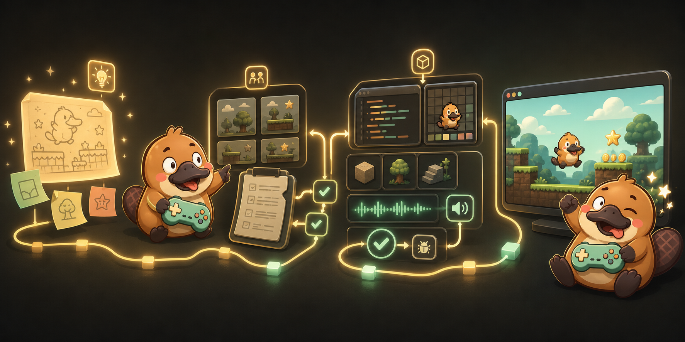
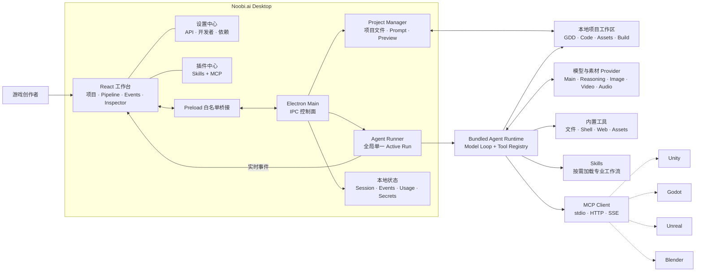
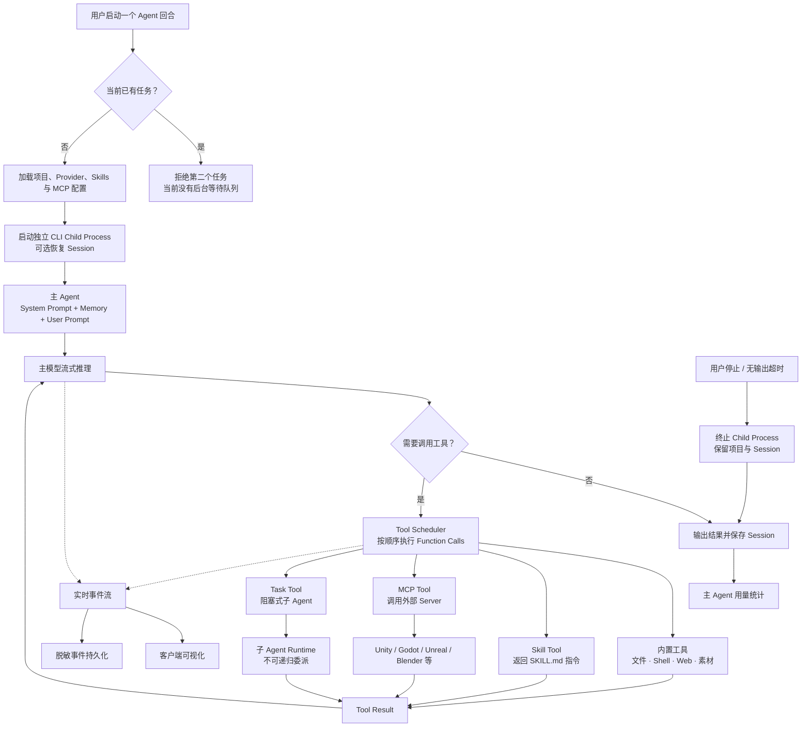

<div align="center">
  
  <h1>Noobi.ai</h1>
  <p><strong>把一个游戏想法，变成可运行、可继续迭代的本地项目。</strong></p>
  <p>
    面向 macOS 的本地优先 AI 游戏制作客户端。让 Agent 在可见的工作区中规划、
    编码、调用工具、运行验证，并通过插件连接 Skills、MCP 与游戏引擎。
  </p>
  <p>
    <a href="#快速开始">快速开始</a>
    ·
    <a href="#产品架构">产品架构</a>
    ·
    <a href="docs/gameagent/DESKTOP_GUIDE.md">使用文档</a>
    ·
    <a href="https://github.com/Innate-Labs/Noobi.ai/issues">问题反馈</a>
  </p>
  <p>
    
    
    
    
  </p>
</div>

<div align="center">
  
</div>

## 产品业务：Noobi.ai 解决什么问题

游戏原型制作横跨策划文档、素材服务、代码编辑器、终端、浏览器与游戏引擎。普通 AI 对话可以给出代码片段，却很难持续理解一个真实工程，更难让创作者看清它改了什么、调用了什么，以及失败后如何继续。

Noobi.ai 把这些环节组织成一条可观察、可停止、可恢复的本地制作流程：

| 传统痛点                         | Noobi.ai 的处理方式                                                  |
| -------------------------------- | -------------------------------------------------------------------- |
| 创意散落在聊天、文档和多个工具里 | 以本地项目为中心保存 Prompt、GDD、代码、素材与构建结果               |
| Agent 工作像黑盒，出错后难定位   | 展示制作阶段、实时事件、Function Calling、文件变化与错误             |
| 每次都要重新搭工程、写提示词     | 通过游戏模板、项目级 / 用户级 Skill 复用专业工作流                   |
| AI 只能“建议”，不能连接真实工具  | 通过 MCP 把已配置的 Unity、Godot、Unreal、Blender 等工具暴露给 Agent |
| 模型、密钥和本机依赖分散管理     | 在设置中统一管理 Provider、测速、Token 统计、开发者诊断与依赖        |
| 中断一次就要从头开始             | 保留项目文件与 Session，可停止、恢复并继续迭代                       |

Noobi.ai 面向独立游戏开发者、游戏策划、技术美术和小型制作团队。它的目标是缩短“想法 → 首个可玩版本 → 持续迭代”的路径，而不是替代创意判断、代码审查或最终质量把关。

## 从想法到可玩版本

<div align="center">
  
</div>

1. **描述创意**：选择本地目录，用自然语言说明玩法、视角、主题与美术方向。
2. **形成计划**：Agent 识别项目类型，生成或更新 GDD，拆解制作阶段与任务。
3. **制作工程**：Agent 创建文件、实现玩法、组织素材，并按需加载 Skill 或调用 MCP 工具。
4. **运行验证**：执行构建与测试，把结果、错误和工具调用实时回传到客户端。
5. **试玩迭代**：查看本地预览和文件，继续给出修改要求；已有工程与 Session 会被保留。

## 核心能力

| 业务模块              | 当前能力                                                                                      |
| --------------------- | --------------------------------------------------------------------------------------------- |
| **AI 游戏制作工作台** | 项目、制作阶段、事件流、文件浏览与 Web 游戏预览集中在一个桌面客户端                           |
| **可观察 Agent**      | 支持停止、会话恢复、崩溃隔离、无输出监控，以及脱敏后的 Function Calling 查看                  |
| **插件中心**          | 将 Skills 与 MCP 合并为插件能力；提供精选目录，也支持从本地或 GitHub 安装 Skill               |
| **模型与素材服务**    | 配置主 Agent、reasoning、image、video、audio Provider，并进行基础连接测速                     |
| **调用与成本诊断**    | 展示主 Agent 实际工作调用、延迟与 Token 统计；用于本机诊断，不替代供应商账单                  |
| **开发者模式**        | 查看项目 Prompt、Function Calling 和当前单任务调度状态                                        |
| **依赖管理**          | 检测并按白名单安装或更新 Node / npx、uvx、Godot、Blender、Unity Hub；Unity Editor 由 Hub 管理 |
| **本地与安全**        | 工程保存在用户选择的目录；API Key 与 MCP Secret 使用 macOS 系统安全存储                       |

## 插件与游戏引擎

Skill 与 MCP 承担不同职责：

- **Skill** 是 Agent 按需加载的专业说明和工作方法。安装 Skill 不等于已经连接编辑器。
- **MCP** 是实际工具通道。保存配置后，Noobi.ai 会在**下一次 Agent 启动**时连接 Server、发现工具并提供给 Agent。
- **依赖管理**只负责检测、安装、更新或打开宿主软件；它本身不是 Agent 控制通道。

| 目标            | 当前接入方式     | 使用前提                                               |
| --------------- | ---------------- | ------------------------------------------------------ |
| Phaser Web 游戏 | 内置生产流程     | Node.js 与项目依赖可用                                 |
| Unity           | 推荐 Skill + MCP | Unity Hub / Editor、对应 Package 或 Editor 侧 MCP 服务 |
| Godot           | 推荐 Skill + MCP | Godot、Node / npx 与对应 MCP 服务                      |
| Unreal Engine   | 推荐 Skill + MCP | Unreal Editor、对应插件与正在运行的 MCP 服务           |
| Blender         | 推荐 MCP         | Blender 与对应 add-on / MCP Server                     |

> 第三方 Skill 与 MCP 可能执行代码、访问编辑器或接收配置的凭据。只应安装和启用可信来源，并在交付前审查生成代码、素材授权与构建结果。

## 产品架构



虚线表示需要额外安装和配置的外部工具。Renderer 无法直接读取密钥；敏感配置由主进程解密后，通过独立通道只交给本轮 Agent Runtime。

## 产品 Agent 结构



当前桌面调度器一次只运行一个 Agent 任务；同一轮中的多个 Function Call 也会顺序执行。Task 子 Agent 会等待完成，不等同于后台并行的多 Agent 集群。MCP Server 的启动发现可以并行进行，单个 Server 失败不会阻断其他 Server。

## 能力边界

> Noobi.ai 是自动化开发工具，不是“一键生成商业成品”的无代码平台。

- 当前内置、验证最完整的生产流程面向 **2D Phaser Web 游戏**；Unity、Godot、Unreal 与 Blender 依赖外部插件、MCP Server 和正确运行的本机环境。
- 内置预览要求项目存在 <code>dist/index.html</code>；引擎项目需要在对应编辑器中运行。
- 图像、视频、音频和模型调用依赖用户自己的 API、网络、额度与供应商能力，费用由服务商收取。
- Token 与延迟统计当前覆盖 Provider 连接测试和主 Agent 最终结果，不等同于供应商账单，也尚未逐项记录所有内部素材请求。
- Agent 可以在项目目录写文件并运行命令。建议使用 Git 或其他方式备份，并在发布前完成代码、许可证与素材来源审查。
- 当前没有云同步、多人协作或内置自动更新；公开构建仍需 Apple Developer ID 签名与公证。

## 快速开始

### 环境要求

- macOS（当前构建流程主要在 Apple Silicon 上验证）
- Node.js 20 或更高版本
- npm 与 Git

### 从源码启动

```bash
git clone https://github.com/Innate-Labs/Noobi.ai.git
cd Noobi.ai
npm install
npm run bundle
npm run desktop
```

首次使用：

1. 打开“设置 → API 管理”，配置主 Agent 的 Provider、Model、Base URL 与 API Key。
2. 新建项目，选择本地目录并输入游戏创意。
3. 启动 Agent，在工作台中观察阶段、工具调用、文件和预览。
4. 如需外部引擎，在“插件”安装对应 Skill / MCP，并在“设置 → 依赖管理”补齐本机环境。

### 构建 macOS 安装包

```bash
npm run desktop:package
```

该命令会构建 Agent Runtime、桌面界面和运行时依赖，完成 Runtime 冒烟测试，然后生成 DMG。当前版本的产物位于：

```text
packages/desktop/release/Noobi.ai-0.2.2-arm64.dmg
```

本地构建没有 Apple Developer ID 时不会获得 Apple 公证。首次打开可在 Finder 中按住 Control 点击应用并选择“打开”，或前往“系统设置 → 隐私与安全性”确认打开。

正式签名与公证构建需要配置 Apple 签名凭据，然后运行：

```bash
npm run desktop:package:signed
```

仅生成未封装的本机调试 App：

```bash
npm run desktop:package:app
```

## 开发与验证

```bash
# 桌面端类型检查与生产构建
npm run desktop:build

# 桌面端测试
npm test --workspace=@gameagent/desktop

# 全仓类型检查
npm run typecheck
```

更多资料：

- [桌面使用说明](docs/gameagent/DESKTOP_GUIDE.md)
- [API 配置](docs/gameagent/API_CONFIGURATION.md)
- [详细技术架构](docs/gameagent/ARCHITECTURE.md)

### Agent 无输出保护

桌面版监控 Agent Runtime 的模型与工具输出：连续 90 秒无输出时显示等待提示，连续 4 分钟无输出时停止本轮并保留项目文件与 Session ID，可从原会话继续。可通过环境变量调整：

```bash
GAMEAGENT_AGENT_IDLE_TIMEOUT_MS=360000 npm run desktop
```

## 许可证与品牌

项目代码按 [Apache-2.0 License](LICENSE) 开放。Noobi.ai、其 IP 形象与桌面产品设计由 Innate Labs 维护。

第三方引擎、Skill、MCP 与品牌名称归各自权利人所有；这些名称仅用于说明兼容性与连接能力，不代表相关品牌对 Noobi.ai 的认可或背书。

## 参与贡献

欢迎提交 [Issue](https://github.com/Innate-Labs/Noobi.ai/issues) 或 Pull Request。涉及第三方 Skill / MCP 时，请同时说明来源、许可证、运行依赖和安全边界。
