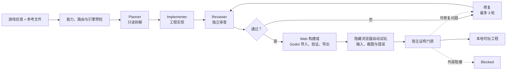
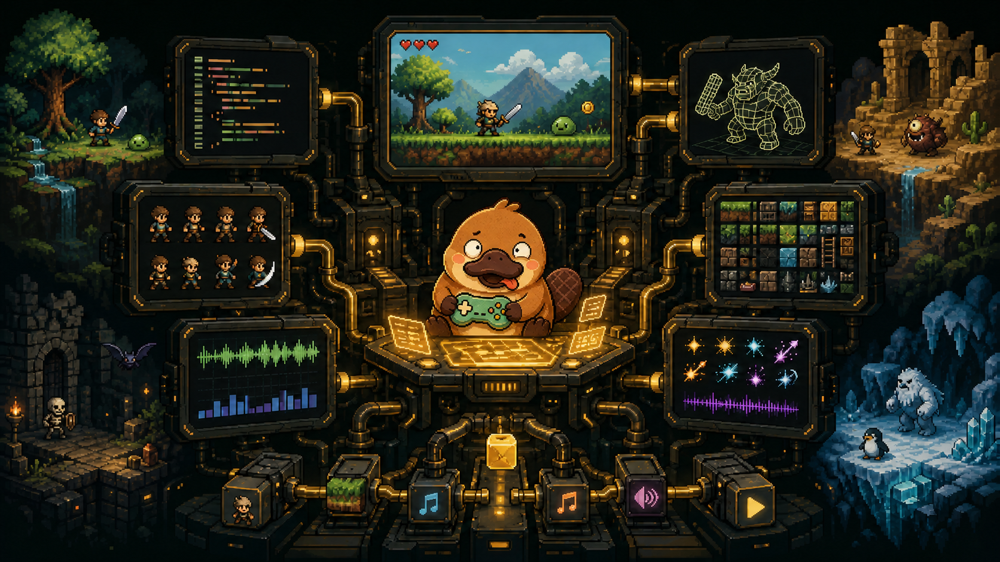

<p align="center">
  
</p>

<h1 align="center">Noobi.ai</h1>

<p align="center">
  <strong>把一句游戏创意，变成经过审查、可以游玩的 Web 或 Godot 游戏。</strong><br>
  基于 Codex App Server 与 Godot 4 的本地优先桌面游戏制作 Agent。
</p>

<p align="center">
  <a href="https://github.com/Innate-Labs/Noobi.ai/actions/workflows/ci.yml"></a>
  <a href="https://github.com/Innate-Labs/Noobi.ai/stargazers"></a>
  <a href="https://github.com/Innate-Labs/Noobi.ai/forks"></a>
  
  
</p>

<p align="center">
  <a href="#快速开始"><strong>从源码运行</strong></a> ·
  <a href="#fork-并定制"><strong>Fork 并定制</strong></a> ·
  <a href="docs/ARCHITECTURE.md"><strong>架构文档</strong></a> ·
  <a href="README.md"><strong>English</strong></a>
</p>


Noobi.ai 不让单个 Agent 在一次回合里即兴完成所有工作，而是把 Codex 放进一条有边界的游戏制作循环：只读 Planner 拆解任务，Implementer 在独立工程目录中实现，独立 Reviewer 检查真实结果，宿主再正式构建并自动试玩。审查、构建或体验评测未通过时，会交回同一个 Implementer，最多连续修复三轮。

> **当前状态：** macOS 开发者预览版。项目暂未发布已签名、公证的安装包，请从源码运行。生成结果是你自己工作区里的独立 Web 或 Godot 4 游戏工程。

### 先选制作方案，再开始开发

提交新创意或修改要求后，Noobi 先生成可比较的方案。新游戏提供 2–3 条路线，已有项目的小改动可以只提供一套。查看核心玩法、范围、假设和交付平台，选择后点击「按此方案开始制作」。生成方案会调用当前模型、计入分析消耗，但不会开始实现游戏或生成素材。没有实测依据时，耗时和费用显示为待估算。

方案会保存在本地，可从「已保存的制作方案」找回，也可以取消或重新生成。宿主绑定选定的方案版本，重复点击不会产生多个制作任务。视觉参考独立保存，重启后可继续使用；普通生产附件仍需重新添加。点击「编辑此方案」可修改玩法、镜头、区域、角色、风格、平台与预算范围。保存形成新版本并自动锁定改动字段；需校验编辑后的方案，冲突解决后才能开始。再次修改锁定字段前先解锁。支持文字调整、组合路线、粘贴或导入 UTF-8 Markdown/TXT 计划（最多 12000 字、48 KB）及版本历史。已有工程的变更方案保留原要求，列出影响系统、存档假设和回归范围，并绑定规划时工程版本。点击「添加游戏参考图」可导入 1–5 张 PNG/JPEG/WebP（单张 12 MiB、总量 32 MiB、最多 1600 万像素），分别指定美术、角色、布局或界面用途。规划模型实际接收图片，理解卡区分可见事实、玩法推断和未知项；修正后校验新方案再开始。Godot 评审截图保留副本并绑定当前构建，截图不证明操作和隐藏规则。点击「添加游戏片段」可导入一个 MP4/MOV（最多 200 MiB、10 分钟、约 1080p），选择 1–120 秒，用本机 FFmpeg/ffprobe 提取带时间的关键帧。可组合图片参考，查看并修改事件时间轴和规则假设，再校验改编方案。不分析音频；抽帧可能遗漏快动作，不能证明确切按键或隐藏公式。模型、分析规则、需求和输入哈希完全相同的新请求可复用已保存分析；手动重试仍重新调用模型。

已有启动方案的项目停止或失败后，保持输入为空，点击「继续制作」即可继续原方案；输入新要求仍会进入规划。「制作进度」面板会在本地保存制作步骤、中断、失败原因及历次执行记录。重启后保留记录，等待你明确继续。只有工程文件和制作设置匹配时，才复用已完成的规划、实现回合；评审和交付检查重新执行。旧项目从下一次开始或继续制作时建立记录。当前支持制作步骤之间的恢复，尚不支持任意工具执行位置续跑；任务完成数也不代表游戏品质完成度。

制作进度详情还展示每个步骤的前置依赖、已选需求编号和完成标准。每次执行保存输入/输出源码摘要、素材引用，以及匹配当前工程的冻结构建/报告摘要；修复与复核形成独立依赖记录，保留旧失败结论。只读评审期间或步骤之间源码发生变化时停止沿用旧证据；旧版没有记录的信息明确显示未知。

每个选定方案的执行预算跨重启保留：默认 40 个模型回合、6 个修复回合（包含核心玩法和画面样板补齐）、6 次宿主网络重连。派发前保存预留次数，失败也计入；单个回合重连达到 6 次后停止，短暂收到模型响应不会清零上限。完成修复后，源码与同组验收问题仍重复出现时停止再次修复。进度面板显示故障类别、原始原因、处理建议与累计次数。停止或失败后可明确点击增加 20 回合、3 修复、3 重连，不自动开工，也不清除无进展证据。这些是执行次数限制，尚不是金额或 Token 费用上限；一个回合内的外部素材调用及启用统计前的旧消耗尚未完整计量。

### 可玩版本与恢复副本

右侧「版本历史与恢复」保存交付检查通过的游戏版本，显示失败记录、手动备份和文件变更数量。新制作失败时仍能试玩最后通过检查的存档。恢复会先备份当前工程，再创建包含所选版本代码、方案、工程内素材和来源账本的独立副本；原项目及后来上传的资料保留，副本不会自动制作。旧报告移入历史，继续时重新验证。

旧 Godot 构建仅提供历史预览，不冒充完整可恢复版本。自动失败记录只保存原因；需要保存失败工程时使用手动备份。快照排除 Git 历史、依赖目录和导入缓存，不包含工程外文件或浏览器游玩存档；目前每份上限 20,000 个文件 / 2 GiB，暂不自动清理历史。完整范围与验收步骤见 [版本恢复报告](docs/development-plan/reports/09-platform-version-recovery.md)。

### 3D 场景覆盖与样板门槛

Godot 3D 制作现在先检查代表性场景，再扩展内容，最终交付重新检查。运行探针独立登记模型、程序地形和 MultiMesh 实例对象，核对场景规格、资源、材质及碰撞结构；未登记对象、未访问场景和采样超限都会要求补齐。真实操作需要提供变化的相机视角、玩家与地形/实体机关的接触、交互前后状态及截图。

体验报告新增「3D 场景检查」，分开展示自动覆盖核对与画面审查重点。登记齐全不等于画面合格；独立 Reviewer 仍须检查实际截图中的占位外观、风格、比例、灯光、遮挡与穿模。当前检查支持 Godot 3D，Web Three.js 场景尚未接入此探针；未覆盖或未声明的隐藏关卡不能因此被认定完成。见 [场景质量专项与验收步骤](docs/development-plan/reports/10-platform-scene-quality.md)。

## 为什么选择 Noobi.ai

| | 你会得到什么 |
| --- | --- |
| **从创意到可玩结果** | 输入自然语言创意，由 Agent 判断使用 Web 或 Godot 4，产出真实游戏工程并在应用内本地预览。 |
| **经过审查的制作循环** | Planner → Implementer → Reviewer → 正式构建 → 自动试玩；失败后最多进行三轮有界修复。 |
| **自动体验评测** | 隔离的隐藏浏览器会操作主要玩法、记录截图，检查可见画面、动画连续性和运行错误。 |
| **真实多媒体管线** | 图片、音乐、语音、音效和 3D 可走配置的 Provider、Codex ImageGen、导入素材或程序化回退；失败素材仍以可重试占位留在素材页。 |
| **工程归用户所有** | 每个游戏都是普通本地项目，可以检查文件、继续用 Codex 修改、提交 Git，或完全脱离 Noobi.ai 使用。 |
| **为扩展而设计** | 可增加媒体 Provider、Codex Skills、MCP Server、角色提示词、工程模板、Godot 导出目标或全新的工作台 UI。 |

## 快速开始

### 环境要求

- macOS（当前已测试、已配置打包的目标平台）
- Node.js 22.20.0（见 `.nvmrc`）与 npm 10.9.3
- 可用的 ChatGPT/Codex 账户
- 可用的图片生成路线：已配置图片 Provider 或 Codex ImageGen
- 只有 Agent 判断需要 Godot 时，才要求 Godot 4 与版本精确匹配的 Web Export Templates

```bash
git clone https://github.com/Innate-Labs/Noobi.ai.git
cd Noobi.ai
npm ci
npm run dev
```

首次启动后，打开**设置 → Codex 账户**完成登录。Noobi.ai 使用应用私有的 `userData/codex-home`，不会覆盖全局 `~/.codex` 配置。

如果应用无法自动找到 Codex，可显式指定二进制：

```bash
NOOBI_CODEX_BIN=/absolute/path/to/codex npm run dev
```

## 从一句创意到可玩工程



工作台用 `Brief → Scaffold → GDD → Assets → World → Code → Verify → Complete` 展示制作进度；真正的完成条件由 Reviewer 与宿主证明门禁共同决定。



## Fork 并定制

Noobi.ai 把关键能力放在可替换的边界上，一个有价值的 Fork 可以从很小的改动开始：

| 目标 | 从这里开始 |
| --- | --- |
| 增加或修改媒体 Provider | [`mediaProviderStore.ts`](src/main/mediaProviderStore.ts) 与 [`mediaGenerationService.ts`](src/main/mediaGenerationService.ts) |
| 通过 MCP 连接工具或内部服务 | [`mcpConfigManager.ts`](src/main/mcpConfigManager.ts) |
| 修改 Planner、Implementer、Reviewer 或 Repair 行为 | [`promptTemplateStore.ts`](src/main/promptTemplateStore.ts) 与 [`gameHarness.ts`](src/main/gameHarness.ts) 的提示词契约 |
| 修改生成工程的脚手架与规则 | [`workspaceTemplate.ts`](src/main/workspaceTemplate.ts) |
| 构建全新的制作体验 | [`src/renderer/components`](src/renderer/components) |
| 增加宿主侧 Dynamic Tool | [`mediaToolBroker.ts`](src/main/mediaToolBroker.ts) |

适合第一次贡献的方向包括：新增 Provider 适配器、Windows/Linux 打包、示例游戏展廊、无障碍优化和更多确定性游戏模板。详见[路线图](ROADMAP.md)与[贡献指南](CONTRIBUTING.md)。

## 核心能力

### 制作工作台

- 八个可视制作阶段与实时 Agent 事件流
- 命令和文件修改审批
- 本地可玩预览、工程文件树与统一素材库
- Agent 自动选择 Web 或 Godot 4，并检查 Godot 环境与 Export Templates
- 使用宿主管理的内部时序与动画契约，不再让用户选择帧率生成策略
- Noobi 多角色分工、动作状态、可选工坊场景和动态钓鱼背景
- 持久化项目与可恢复的 Codex Implementer 线程

### 媒体与扩展

- 可配置图片、音频与 3D REST Provider
- 必需图片生成的 Codex ImageGen 回退
- 音乐、语音、人声音效、程序化 WAV 与 Web Audio 路线
- 默认先生成参考图片，再由 AI 编写 Three.js 模型；宿主导出 GLB 并独立拍摄正、侧、背面检查图
- 上传的图片和文件可影响需求拆解、视觉方向与素材复用
- 失败素材工单保留占位、错误与尝试次数，可单项重新生成
- Codex 原生 Skills、stdio/HTTP MCP Server 与分角色提示词

### 安全边界

- Electron Renderer 开启 sandbox，只通过 typed IPC 与 Main 通信
- API Key 使用 Electron `safeStorage` 加密，保存后不会向 Renderer 回传明文
- 本地预览只绑定 `127.0.0.1`
- 对生成素材重新校验路径、symlink、MIME、大小、SHA-256 与生产代码引用

完整说明见[产品功能拆解](docs/PRODUCT_FUNCTIONS.md)与[架构文档](docs/ARCHITECTURE.md)。

## 开发与验证

```bash
npm run typecheck       # Renderer + Main 类型检查
npm test                # 单元与集成测试
npm run build           # 生产构建
npm run verify          # 类型检查 + 测试 + 生产构建
npm run smoke:ui        # 隔离数据的 Electron UI 截图
```

以下真实 smoke 会使用已登录账户，并可能消耗少量 Codex 或媒体 Provider 额度：

```bash
npm run smoke:codex
npm run smoke:harness
npm run smoke:media
npm run smoke:image
npm run smoke:model3d
npm run smoke:godot
npm run smoke:playtest
```

在本机生成未签名的 macOS DMG：

```bash
npm run package:mac
```

公网分发仍需 Developer ID 签名、Apple notarization 与 staple。

## 当前边界

- 当前支持 Web 与 Godot 4/GDScript 工程。Godot 自动交付目前使用 Compatibility renderer 的 Web 导出，尚未接通原生 macOS、Windows、Linux 可执行包。
- 当前发行目标是 macOS；Windows 与 Linux 桌面工作流在路线图中。
- Meshy、Tripo、Rodin 当前使用同步 REST 网关契约，并非全部厂商异步任务 API 的原生编排。
- 图片参考建模保留规格和可编辑源码，默认不调用 3D API，也不再按关键词套六种固定模板。模型外形由 Reviewer 对照参考图和多角度证据验收；单图不可见的背面只能推断。图片生成和 AI 编码仍消耗相应额度。
- 生成质量与完成率取决于模型、提示、依赖和媒体能力；不能通过证明门禁的任务会保持 `blocked`，不会伪装完成。

## 参与贡献

欢迎提升管线安全性、可移植性和可扩展性的贡献。请先阅读 [`CONTRIBUTING.md`](CONTRIBUTING.md)，运行 `npm run verify`，再提交范围清晰的 Pull Request。安全问题请按 [`SECURITY.md`](SECURITY.md) 私下报告。

## 许可证

项目所有者尚未发布许可证。在正式加入 `LICENSE` 前，仓库内容仍受默认版权规则约束。如果你准备分发衍生版本，请关注[仓库 Issues](https://github.com/Innate-Labs/Noobi.ai/issues)或先联系维护者。

## 文档

- [架构](docs/ARCHITECTURE.md)
- [产品功能](docs/PRODUCT_FUNCTIONS.md)
- [Codex 源码阅读基线](docs/CODEX_SOURCE_NOTES.md)
- [路线图](ROADMAP.md)
- [贡献指南](CONTRIBUTING.md)
- [安全策略](SECURITY.md)

### 免费游戏音频

默认使用内置 CC0 素材库：2 首背景音乐、16 个音效，离线选取并导入，不调用音频 API。素材保留作者、来源和授权信息。这是现成素材选取，暂不提供定制配乐或语音；需要云端生成时，可在“设置 → 媒体 API”手动切换音频来源并保存。参见[素材来源与授权](resources/free-audio/LICENSES.md)。

### 图片参考 → Three.js 模型

[运行样板](examples/image-threejs/README.md)包含参考图、建模规格和源码。使用 `npm run smoke:model3d` 验证隔离导出、贴图、三视图、执行限制与 Godot 导入。默认模式无需 3D API；可在“设置 → 媒体 API”手动切换为外部服务并保存。
