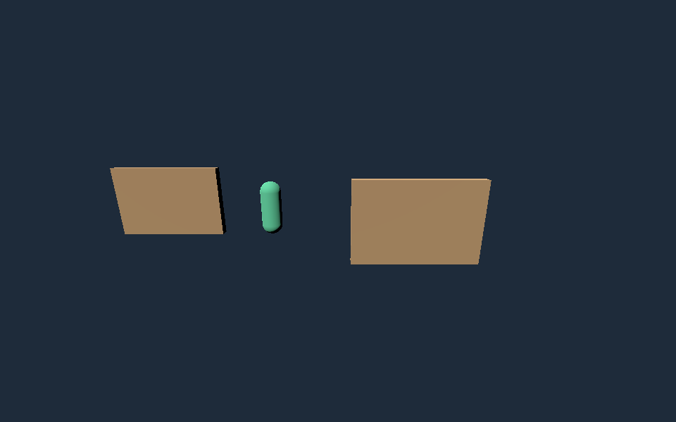
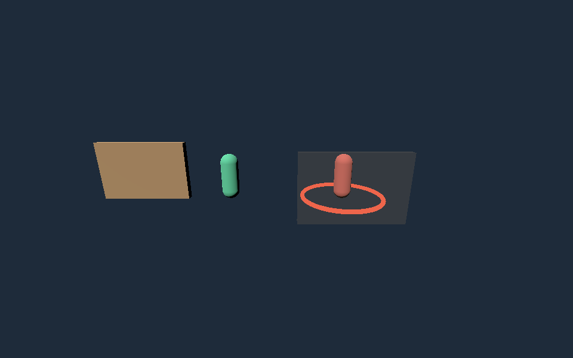

# 阶段 06：通用第三人称 3D 组件与样板

日期：2026-09-26。基线 `87c5650`。状态：开发中；通用组件自验完成，完整自主生成验收未完成。

用户授权连续推进，人工验收独立保留。原阶段 06-D01–D04 / A01–A04 标准不降低；工程测试场景和 Noobi 自主生成作品分别记录。《章鱼云岛》失败记录保留，不追加其修复预算。

## 实施范围

新 Godot 工程提供 `runtime/noobi/ADVENTURE_V1.md` 与 `CHECKPOINT_V1.md` 所述版本化组件。既有工程不自动覆盖；组件不是最终美术，也不强制非战斗游戏加入战斗。

- 第三人称控制：相机相对移动、按物理帧更新、重力/地面吸附、缓冲跳跃、低台阶/低顶判断、冲刺解锁与冷却、生命/无敌时间/死亡和恢复；动作状态由游戏绑定实际模型。
- 相机：肩部跟随、带球形碰撞的 SpringArm、忽略自身碰撞体、俯仰限制；可请求鼠标锁定，也可明确使用右键拖拽。非锁定模式使用实际光标位置差，修复相对位移为零导致拖拽无效的问题。
- 交互/轻战斗：距离、视线遮挡、条件与一次性消费共同校验；近战按朝向、距离和遮挡区分命中/空挥。敌人有追近、预警、攻击判定、恢复、受伤/死亡状态；未配置导航时只做直线可见目标追踪，不宣称通用寻路。
- 暂停/焦点：释放鼠标及残留操作，重新聚焦不自动恢复；游戏接收 `focus_lost` 后显示恢复入口。除 Godot 应用/窗口通知，还监听 Web 的 blur/visibilitychange，并在节点退出时移除监听。
- 检查点：游戏/内容/格式版本与 SHA-256 校验、临时文件提交、上一档备份、强制游戏状态校验；损坏/未来版本禁止覆盖，明确新游戏后归档旧档。进度与已消费物件一起保存。JSON 数字必须按数值范围及整数性校验。
- 调度：实时 3D 游戏也先验证核心循环，再进入美术样板；回合制 3D 卡牌不误套实时控制流程。补齐最终交付步骤的源码/资产/构建证据记录。

## 开发项映射

| 项目 | 当前证据 | 尚需完成 |
|---|---|---|
| 06-D01 | 通用控制/相机/交互/暂停，物理与浏览器验证 | 生成作品中的装配与正常使用 |
| 06-D02 | 敌人、轻战斗、机关、能力及终点工程集成测试 | 自主作品实际玩法与动画 |
| 06-D03 | 实时 3D 核心循环调度、现有运行探针、真实浏览器输入与存档 | 生成作品受伤/失败/重开完整路线 |
| 06-D04 | 图片参考真实分析生成两套方案，选定第一套开始制作 | 至少两次独立生成全链验收 |

D01/D02 的通用组件与工程自验已实现并勾选；生成装配、D03/D04 和 A/U 项仍独立保留，不能用组件测试代替完整生成闭环。

## 验证与证据

证据保存在本机忽略目录 `.noobi-private/stage-06/`，包含测试工程、构建、截图与日志；不提交用户图片、账户资料或私有游戏源码。

| 验证 | 命令与结果 | 边界 |
|---|---|---|
| 引擎物理 | `node scripts/adventure-kit-smoke.mjs`，退出 0；30/60/120 物理帧率各 27 项 | 真实 Godot 引擎 Input.action_press，开发者工程场景，非模型生成 |
| 存档 | `node scripts/checkpoint-kit-smoke.mjs`，退出 0 | 损坏/错版本/非法路径保护、备份和独立引擎进程重载 |
| 浏览器 | `electron scripts/adventure-browser-smoke.mjs --drag-only`，退出 0 | 实际 Electron 键鼠及浏览器内容焦点 API；主角/地形是明确标识的工程几何 |
| 全仓检查 | `npm run verify`：最终组件修订后 639 项、77 文件通过，退出 0；记录于 verify.log | TypeScript、单元/集成测试、生产构建 |
| Noobi 界面 | `npm run smoke:ui`，退出 0，截图保存在 `.noobi-smoke/workbench.png` | 已检查实际界面截图，不能代表生成游戏 UI |

物理测试包括落地、步速一致性、跳跃、冲刺锁定/恢复、台阶、低顶、斜坡、高墙、相机收缩/恢复、遮挡交互、一次性奖励、近战正面命中/背向空挥、受伤无敌、死亡/重置、暂停/恢复、敌人预警/命中/恢复及真实地面躲避。已修复胶囊接触台阶圆边导致登阶失败的问题；采用前方地面探测与完整碰撞体向上/向前扫描，只抬升 Y，移动仍由一次 move_and_slide 完成。

浏览器结果：`browser/2026-09-25T19-46-03.281Z/results.json`；构建 `44bb6b56-a4c7-4548-8860-08247183d040`，源码 `83b02ea01c78912c284c1221db8760dc57c1d8a9a83b8b93f7a250aa60dac637`，产物 `6c558877a79b05fa09a26c6986082a3e8dd0533163e0184377c259d13027a2c3`。真实输入完成开始、移动/跳跃、拾取、保存、暂停、拖拽镜头、失焦暂停、显式恢复、页面重载继续、抵达终点及重开。已检查转镜头、恢复与终点截图；当前测试 HUD 仅用于工程检查，不是最终中文游戏 UI。

失焦测试最初只切换 BrowserWindow，原文档依然报告有焦点，因此该次检查无效且失败记录保留；最终使用 Electron `blurWebView()` 实际转移内容焦点并断言 `document.hasFocus() === false`，再验证游戏暂停。不是伪造 blur 事件或直接修改游戏状态。OS Alt-Tab/锁屏仍待真实人工环境检查。

原生鼠标锁定 **未通过**：当前 Electron 43.3 环境返回 `WrongDocumentError`；最小无 Godot 页面也复现，实际元素已连接、页面可见、有瞬时用户激活。`pointer/result.log` 保留。拖拽通过不替代 06-A01 的原生锁定验收；不将这一项打勾。Godot Web 在画布上监听通知，网页窗口 blur 另有回调，组件追加窗口/可见性处理的依据见 [官方实现](https://github.com/godotengine/godot/blob/master/platform/web/js/libs/library_godot_display.js)。

环境：macOS，Node 22.20，Electron 43.3，Godot/导出模板 4.7.1；浏览器窗口 1100×760，实际截图按设备像素比例采集。以上不是完整性能报告。

## Noobi 自主生成 A：雾灯试炼

采用此前 Noobi 生成的骑士图作为角色参考，只读复用，不修改原游戏。图片仅约束角色比例/配色；关卡、控制、敌人和规则明确为新增设计。

- 通过 Noobi 首页真实上传与输入发起规划，初次 120 秒超时；重启隔离实例后通过 Noobi retryPlan 重试一次，116 秒完成，模型上报 26,649 tokens。初次用量未知，金额未知，不虚构总费用。
- 草案 `66b9d4cf-01f6-4bfd-b7f9-4cdf1f3af7d0`，版本 `7d1f463f-b4df-4d33-a659-afd6a09e7a87`，两套短关卡布局。
- 用户已授权代为选择/继续，选择 `option-1`「折坡门廊」：斜坡→台阶→跳跃缺口→符文/冲刺→敌人门廊→条件机关→终点，含中文 HUD、菜单与保存。
- 使用 Noobi 正式 `startPlan` 接口指定隔离工程目录，项目 `91c87d1d-4ccf-4dfd-a834-82bf9d45d717`，制作记录 `6ecbf1ad-db26-4c72-88db-2b2de85ee3f6`，2026-09-25 19:47 UTC 开始制作；`start-a-result.json` 保存启动绑定。与点击开始按钮相同的宿主入口，明确记录这次自动操作，不冒充人工鼠标点击。
- 开始前重启隔离实例以加载本轮组件。没有人工编辑生成工程；沿用默认 40 回合/6 修复预算，不追加额度。原用户游戏与预算耗尽的《章鱼云岛》不动。
- 20:10 UTC 检查：核心玩法宿主检查已通过，进入画面样板；已使用 3 个模型回合、2 个修复额度。最终交付尚未通过，样板 B 尚未生成。06-A04 未完成。

## 后续与用户验收

继续检查 A 的真实制作/试玩/失败原因，再完成第二次独立生成和原生锁定环境验证。只有全部适用验收有同一构建证据后，才将阶段标为待用户验收。

完整游戏 UI 按用户要求在文档阶段推进后专项落实，必须涵盖主菜单、HUD、任务、背包/能力、地图、暂停/设置、保存/继续、失败/结算，以及不同屏幕尺寸、中文字体与真实状态绑定。目前只有组件和工程 HUD，不能宣布完整 UI 系统已经完成。

## 第二样板与启动修复（2026-09-26）

B《林间哨站：坡顶夺印》实际 Noobi 规划成功，原 draft `9193af50-661a-481a-9ff2-dc20ce407a24` 首次因项目目录不存在而启动失败，原记录保留。修复启动前校验并通过正式复制失败方案入口恢复，复用的 draft `c38aad3a-e622-45eb-a868-e040e632084d`，项目 `da372618-8727-499f-933c-b1d27df2db96`，隔离 CDP 9352。已开始实际制作，未宣布完成。A 仍在自身预算内进行场景/输入修复；没有人工修改 A/B 的生成工程。

## 生成 A 故障与后续检查

2026-09-25 21:16 UTC，A 在画面样板阶段停止，宿主构建/试玩接口报 `Failed to allocate memory`，最新加载检查 0 分，其余检查 skipped。此前独立画面评审仍指出墙体遮住主角/威胁反馈，不能只消除加载错误就宣布样板达标。B 同时仍在原预算制作画面。21:35 UTC 系统可用内存报告 36%，不能据错误文本断言电脑整体内存耗尽；准备释放已完成的隔离验证窗口并重启失败的 A 实例，保持原运行预算与失败记录。

完整游戏 UI 通用组件现已完成实际键鼠和原生状态/设置检查，见阶段 12 报告；A/B 的成品接入仍另行验证。

21:36 UTC，已通过正式 `resumeProject` 在 A 原 run 上恢复，预算沿用 40/6/6，没有增加额度；恢复前为 6 回合、3 修复、1 重连，调用记录 `.noobi-private/stage-06/resumed-a.json`。重启释放了实例资源，但不视为根因已修复，仍需复查实际加载与画面。

由该失败补充平台防护：资源错误独立分类为「运行资源故障」，保留原错误和处理建议；核心玩法、视觉样板及通用修复调度在内存/磁盘不足时停止进入新的代码修复回合。错误本身不能区分宿主压力和游戏分配错误，因此不自动宣称系统故障，也不自动扩预算。回归检查覆盖错误分类和资源失败时不执行实现回合，`npm run verify` 83 文件 / 665 测试通过（退出 0），日志 `.noobi-private/stage-06/resource-verify.log`。现有运行实例不会热替换主进程，后续重启加载此防护。

B 于 21:43 UTC 经独立画面评审仍失败：评审称有暂停黑图，并指出地形硬边、守卫死亡悬浮、跳跃缺口可读性，以及未覆盖的交互/音频证据。其中“暂停黑图”在后续保存证据复核中不成立，见下方纠错，不能作为已确认事实。21:50 UTC 通过正式 `resumeProject` 在原预算继续，之前使用 6 回合/3 修复，记录 `.noobi-private/stage-06/b/resumed-b.json`；没有增加预算。A 21:53 UTC 仍在画面样板，累计 9 回合/5 修复/1 重连，达到原上限后必须停止，不自动扩额。

## 22:24 UTC 失败复核与最后预算恢复

B 在 22:21:50 再次失败，累计 11 回合 / 5 修复 / 0 重连。固定构建 `42686c9f-2239-45a7-b307-49e2a4d49b7a`，源 `98792cd094683931ca78e5cafa6aed64d4706dc98c3f0898987e24ef549a9c88`，产物 `6a444ce05677b3b798993afc23f5177a9dad214a4157b7ee9a7a29dac626c4a9`。宿主无运行错误，但战斗后玩家生命 0、守卫生命 1、无印记，末尾保持 lost；拾取、开门、通关及重开断言失败。已看实际失败菜单截图。

只读源码/清单复核发现：失败菜单提示 Enter 重试，清单末尾却发送仅在 won 状态生效的 R。因此本次只能认定完整路线失败和重开步骤不适用于实际状态，不能直接断言 Enter 重试功能损坏。22:24:09 通过正式 `resumeProject` 在相同 run、原 6 次上限内恢复，最后一次修复可正常完成；没有扩额或手工改游戏。证据 `.noobi-private/stage-06/b/resumed-final-b.json`。A 同时仍执行最后获准修复后的流程，13 回合 / 6 修复 / 2 重连，不能追加修复。

旧 B 评审所称全黑暂停截图，经复核 21:39:48 报告对应两张保存 PNG 都显示菜单；撤回“已确认黑图”的表述，保留评审原文和矛盾记录。平台已另行补上独立暂停画面门槛及真实黑屏负例，见 [阶段 09 报告](09-delivery.md)，不等于 B 成品已通过。

## A 原预算最终停止

A 在 22:23:55 UTC 独立视觉评审失败，最终 13 回合 / 6 修复 / 2 重连，停止且不恢复。固定构建 `515fba8b-c1f2-456b-93e8-24d9d471aa52`，源 `72d89c4a34f7b05538ffe05c72cf8518f3ea33dfb0613279b0f114dd30e554c8`，产物 `0d0ddf56b61c7e87ee8e9881116404ee8e2769f63ab5ff2da9fef5d2c869906c`。技术试玩报告 pass、无运行错误，不代表视觉交付通过。

已独立查看 `sample-gate-contact.png` 和 `sample-backwall.png`：前景墙冠确实挡住部分敌人脚部、预警环及地面，影响距离判断。评审还指出未解锁冲刺反馈被后续 E 提示覆盖、音频试听与完整存档退出继续证据不足。最终状态存于 `.noobi-private/stage-06/final-a.json`。后续可改进通用相机对敌人/危险区的可读性，但不得借平台修复扩额恢复 A，或人工改成品冒充自主生成成功。

## 通用前景遮挡可读性组件（2026-09-26）

新增 `adventure_visibility_v1.gd`，由通用相机安装，检查玩家及最多七个附近的已注册敌人/危险区域。每个目标采样脚部、身体、头部和区域边缘，最多四层遮挡；仅淡化明确加入 `noobi_camera_occluder` 的静态前景物件。相同碰撞体每帧只遍历一次网格，射线最多 224 条，网格最多 128 个。这里的上限不等于复杂场景性能已经验收。

材质按实例复制，遮挡解除、目标隐藏、停用、换镜头和组件退出时恢复，不修改共享源材质或碰撞。标准/ORM 材质可用；自定义 ShaderMaterial、next_pass、overlay 保持原样并报告不支持，仍需场景适配。未标记的实体墙不会被淡化。生成阶段指南已写明危险范围标记和实际镜头验收要求；A/B 工程均未被修改。

验证：

- `npm run verify`：84 个文件 / 672 测试通过，`.noobi-private/stage-06/visibility-final-verify.log`。
- `node scripts/adventure-visibility-smoke.mjs`：真实 Godot Compatibility 原生场景 19 项检查通过，最新证据 `visibility/2026-09-25T22-36-24.354Z/report.json`，包含敌人单独受遮挡、危险圈、多层前景、共享材质保护、实际运动碰撞、隐藏恢复、镜头切换、删除节点、外部材质修改和不支持的着色器。
- 已查看遮挡前、淡化后、恢复后三张实际渲染图。最初不透明遮挡负例的墙高度不足，头部射线从墙上方穿过，该失败保留在 `22-34-05.385Z/failure.log`；修正测试遮挡体覆盖全部射线后通过，没有放松生产逻辑。
- 原有 `adventure-kit-smoke.mjs` 在 30/60/120 Hz 各 27 项物理检查通过，记录 `visibility-adventure-regression.log`。

以下为手写工程验证，不是自主生成游戏或成品美术：

尚需：成品注册与自定义着色器适配、浏览器下的新组件验证、密集场景性能和不同镜头角度。R18 仍保留“补齐”，鼠标锁定问题也未借此标记解决。

## B 原预算最终停止

B 于 22:38:22 UTC 停止，13 回合 / 6 修复 / 0 重连，不再自动恢复。错误是远程上下文压缩时向认证服务发送请求失败（`error sending request ... auth.openai.com/oauth/token`），不足以判断是网络还是登录失效；界面旧分类为 quality，但不能把本次终止描述为新的美术拒绝。

最后技术报告 22:35:05 为 pass，构建 `a64c0f63-65e9-4cde-9e5d-0d49f7c5596b`，源 `d00018e38e6e9c5ee32f017a7fef9b7054518dc9af196b5c37d7cc82b18f65fd`，产物 `4e92cc99dfcd8dfb6d24366002268b0c45b19b6d4bb968fd09f6566a4f969cc9`。已查看守卫战后取得印记与终点胜利截图，证明此次采样路线有进展；最终独立视觉评审、完整 UI/存档/音频体验仍没有通过结论。证据 `.noobi-private/stage-06/b/final-b.json`，保留之前死亡路线失败及所有原始记录。

后续平台修复已把这类远程压缩/认证请求发送失败从 quality 阶段回退中独立识别，并阻止它进入新的游戏代码修复，见 [故障分类补充](08-platform-failure-budget.md)。旧 B 状态和预算没有改写，也未借此恢复。
