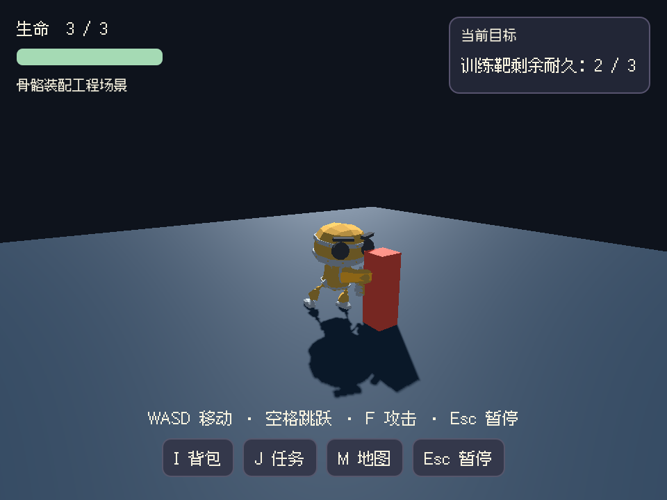
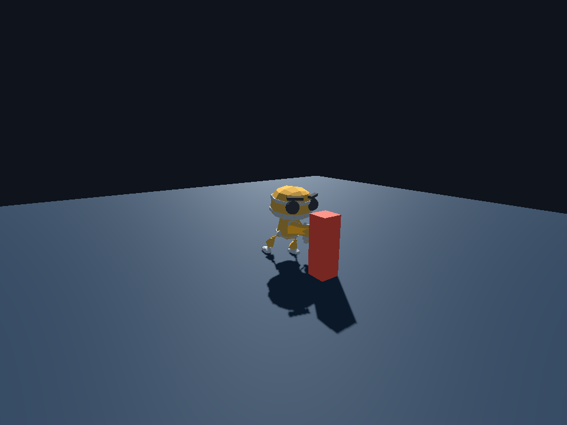

# 真实骨骼角色、挂点、战斗时序与游戏 UI 装配

日期：2026-09-26。状态：本专项开发者自验完成，待用户验收；R14/R15/R20 与阶段 07/12 未整体验收。

## 本轮解决的问题

上一轮验证的是刚体测试网格。此次将真实导入的骨骼角色接入控制器、动作适配器、装备和完整游戏 UI，验证从实际输入到动作/伤害/保存恢复的连接。全部工作在独立工程场景完成，未修改或恢复 A/B、章鱼云岛或原游戏，未购买服务、增加模型执行额度或启动生成调用。

### 可复用平台改动

1. `adventure_rig_v1.gd`：按实际导入的骨骼名称建立装备挂点，最多 12 个；使用 `BoneAttachment3D`，不覆盖骨骼姿态。缺骨骼或无效偏移明确失败，移除组件清理自己的挂点。骨架可能含导入缩放，装备必须按世界尺寸复核。
2. 双脚只读探针：从作者按实际脚部几何校准的两个鞋底点查询地面，记录有无表面、间距、坡面可走性、穿入及接触。空中或无地面不判接触，陡坡不判可走接触。每次仅两条有界射线，不修改骨骼、角色位置或碰撞；不等同于脚底 IK。
3. 动作适配器：除原有轨道节点检查，再确认实际骨骼和 morph 名称存在。错误绑定在播放前失败。
4. 近战时序：增加 `attack_started`、`attack_cancelled` 和可选 `windup_time`。出招时启动片段，在预设命中时刻重新检查距离、朝向和遮挡后结算一次伤害；受伤/死亡/禁用控制会取消等待中的攻击，暂停冻结倒计时。同步开始事件中的取消也有效。默认延迟 0，原有即时攻击仍可用。非零延迟时 `attack()` 返回是否接受出招，最终结果看 hit/missed；传送/重置需显式取消挂起攻击。
5. 通关存档 UI：快照可提供 `outcome=playing/victory/failure`。继续/重试后根据实际结果打开游玩、结局或失败页面，避免把已完成存档默认为仍在游玩。未提供该字段时保持原行为。
6. 正式新工程模板包含上述组件；`ADVENTURE_V1.md`、模型接入指南及生成实现说明同步了骨骼名称、片段缺失、鞋底校准、装备缩放与命中时刻要求。旧游戏没有批量改写。

## 素材与工程范围

角色是 Tomás Laulhé / Quaternius 的 CC0 **RobotExpressive**，来自 three.js r185；转换/优化由 Don McCurdy 提供。来源与许可见 [固定版本 README](https://raw.githubusercontent.com/mrdoob/three.js/r185/examples/models/gltf/RobotExpressive/README.md)。GLB SHA256：`047f5e5fb3bb6d378bd1df16ca6137f2a596c99b3a1b5690b4020c05aaf6f319`。脚本校验固定字节，源 GLB 未改写，未加入默认素材库冒充 Noobi 原创模型。

模型有骨骼驱动的刚性身体部件和真实加权蒙皮手部。测试采用其 Idle/Running/Jump/Punch/Death；原资产没有专门的 Fall/Hurt，因此在工程内明确添加采样自 Jump 的静态下落姿态和手工受击姿态，没有将 No/Yes/Wave 等手势改名冒充。这两个工程片段不证明成品动作创作质量，未写入平台默认动作。

挂点依赖 [Godot BoneAttachment3D](https://docs.godotengine.org/en/stable/classes/class_boneattachment3d.html) 的跟随模式。机器人统一缩放为 0.36；导入骨架自身有 100 倍缩放，装备另行补偿，实测测试棒世界长度 0.65m。

## 验收证据

- `scripts/adventure-skeletal-smoke.mjs` + `scripts/fixtures/adventure-skeletal.gd`：31 项真实 Godot 检查通过。包括导入骨骼/morph、加权手部顶点变化、手骨挂点跟随/世界尺寸、跳跃下落着地、延迟命中一次、目标离开后挥空、暂停和受击取消、碰撞体不变、穿地/悬空/无地面/陡坡负例，以及错误骨骼拒绝与挂点清理。此专项使用 Godot Input action，不能称系统键盘操作。
- 最终工程目录 `.noobi-private/stage-07/skeletal/2026-09-26T01-43-16.027Z/`；`report.json`、`runtime-binding.json` 与 `asset-source.json` 保存检测结果、正式模板脚本哈希和模型来源。
- 待机双脚探针约 `-0.00731m`，在当前 0.04m 接触容差内，**不是严格零穿入**。跑步采样时两脚离地约 0.0446m / 0.0836m，均没有被误标为接触；这一个采样不足以判定完整步态自然。手部相对角色的加权顶点最大变化约 0.896m。
- `windup_time=0.2s`，命中事件发生时动画播放头约 `0.2167s`，误差小于 50ms。已看出招/命中画面，但仍是距离与朝向范围判定，**不是武器网格扫掠碰撞或逐游戏精调后的命中帧认证**。
- `scripts/adventure-skeletal-native-smoke.mjs`：真实 macOS 键盘驱动 10 步通过，涵盖标题、新游戏、移动、骨骼跳跃、出拳扣血、暂停冻结、保存/恢复、胜利、未完成存档恢复，以及保存结局后继续到结局。证据 `native-1790387095284/report.json`。
- 同脚本 `--continue-only` 另起新进程，标题→继续→恢复通关结局 2 步通过，证据 `native-1790387146963/report.json`。探针只读，不写游戏状态；辅助功能使用原有授权，未更改系统权限。这里运行 Godot 项目，不是新的独立发布包或干净设备验收。
- 回归：原动作适配器 33 项通过，日志 `.noobi-private/stage-07/skeletal-animation-regression.log`；原物理/近战组件在 30/60/120 Hz 下各 27 项通过，日志 `skeletal-physics-regression.log`。全仓 `npm run verify`：86 文件、699 项测试及类型检查/构建通过，日志 `skeletal-verify.log`，Vite 大包提示保留。

已查看实际导入、跑步、跳跃、命中，以及标题/HUD/暂停/结局截图。下面是工程 UI 与真实角色连接的截图，训练靶是明确的测试占位物，不是参考图美术或完整场景。

## 保留的失败与修正

- `skeletal/2026-09-26T01-36-57.802Z/` 一轮陡坡负例未通过：测试改变碰撞层/地面旋转后立即读取物理查询。随后固定工程角色并等待两个物理帧再观察，断言通过；没有降低坡度或放宽接触阈值。具体失败目录以本机 `skeletal/` 的 `failure.log` 为准。
- 最终目录第一次系统键盘流程 `native-1790387007321/` 在保存后的按钮定位失败；随后 `native-1790387024642/` 未能恢复通关结局，因为此前流程并未完成通关保存。这两轮均保留 failed。
- 增加按键轨迹并延长事件后的焦点采样等待，再执行实际流程后 10 步及新进程 2 步均通过。没有直接改菜单状态或伪造存档。最终成功目录保留 `key-trace.json`。
- 检查结局 UI 时发现工程存档校验最初拒绝目标耐久 0，而通用 UI 恢复后默认进入游玩。现已允许真实完成状态持久化，并提供正式 outcome 接口；上述成功流程使用实际攻击完成与界面保存。

## 用户验收与下一步

工程可以用 Godot 运行：读取 `.noobi-private/stage-07/skeletal-latest.json` 中的目录，执行 `godot --path <目录> -- --noobi-rig-demo`。正常试玩不需要开启探针。WASD 移动、空格跳跃、F 攻击、Esc 暂停；训练靶耐久为 3，界面保存与继续使用真实检查点。

待验收：观察装备是否跟随、动作是否切换、攻击是否先出招后扣血；暂停时角色应冻结；保存一次未完成进度后可恢复，完成后保存再重启继续应回到结局。

仍需推进自然步态与坡面脚底/IK、跨骨架动作复用、武器实际扫掠/反馈、生成角色的完整动作集、浏览器中的新组件联动，以及按用户参考图统一的场景/UI美术和自主生成成品全流程。第三方机器人测试不能计入自主生成成功，多作品基准仍为 0/30；不恢复耗尽预算的 A/B。
