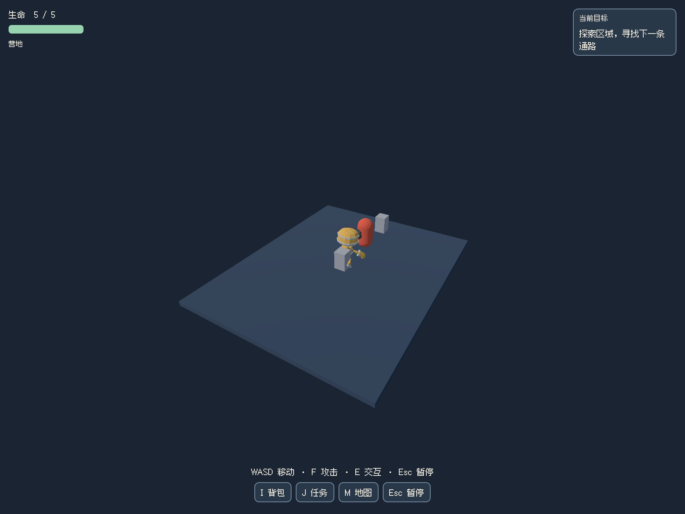
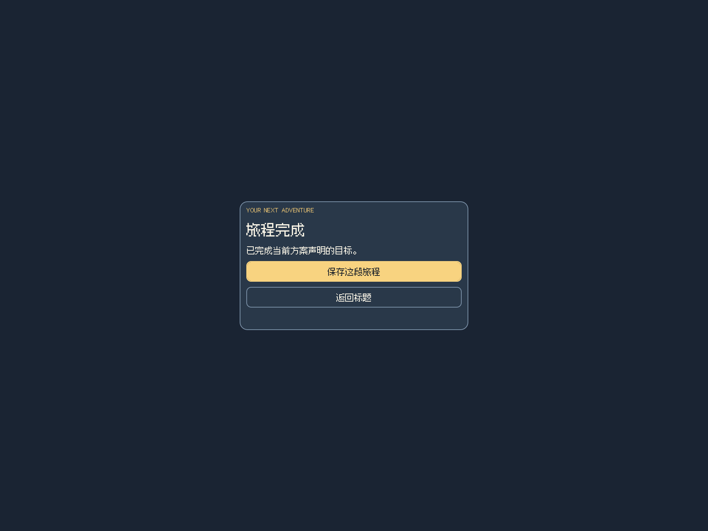

# 阶段 08 / R44：战斗目标与跨区域音频装配

日期：2026-09-26。基线 `0ab24f5`，分支 `codex/stage-01-plan-selection`，本报告与实现同次提交。状态：本轮工程开发者自验通过，待用户验收；完整游戏、美术和真人听感未验收。

本轮对应 08-D01/D04 的击败目标及检查点连接、R44 的区域/事件音频、阶段 12 的状态提示。用户授权继续开发与提交；没有恢复或修改 A/B、章鱼云岛和原游戏，没有购买、调用新生成任务或增加执行预算。30 次自主基准仍 **0/30**。

## 实现与行为

- 击败目标在前置条件和奖励容量满足前锁定 AI 与受伤。单独的 `objective_locked` 不覆盖作者配置的 `enabled`；解锁后真实近战伤害驱动敌人死亡和一次性领奖。死亡后取消尸体阻挡层，恢复已完成检查点时不重新生成目标敌人。
- HUD 选择当前可完成的任务；未满足条件的任务显示“待解锁”，避免一开始就让玩家攻击不可伤害的守卫。任务奖励若遇到非预期提交失败会明确停止并保留诊断，不把死敌人当作已完成任务。
- manifest 增加可选 audio：每个区域选择 Ogg/MP3 或明确静音，配置换曲时间和 quest/travel/hit/hurt/victory/failure 事件。宿主核对映射、路径、文件存在性和大小，冻结音频 SHA；校验缓存版本升为 v2。文件检查不代表解码、许可或音质已通过。
- 装配器复用一个常驻 `audio_v1` 与既有 UI 分轨设置。实际换区交叉渐变，暂停冻结音乐，恢复沿用播放位置；显式新游戏/继续/重试先清理旧声部，按恢复地区选曲。标题停止所有声音，结局停止玩法声音并播放一次菜单提示音；明确静音区域立即停止音乐。
- 修复本机 Web 暂停时 `playing=false` 造成同曲恢复误开第二声部的问题：把仍暂停的当前声部视为有效播放，不因恢复重复分配。未改自动播放策略、引擎、用户总线音量或付费音乐服务。

## 验证结果

本机 macOS / Apple M5 Pro，Godot 4.7.1，Electron 43.3 / Chromium 150，Node 22.20。工程是开发者制作的短路线，第三方固定 SHA 的 CC0 角色配基础几何守卫；音频取自已入库的 CC0 素材并核对 catalog SHA，保留来源清单。不能算自主生成成功或成品美术。

| 验证 | 结果与范围 | 本机证据（`.noobi-private/` 下） |
|---|---|---|
| 装配契约与构建拒绝 | 13 项通过；区域音频遗漏、坏路径、未命名事件、超范围渐变和缺文件拒绝 | `gameAssembly.test.ts` / `godotBuilder.test.ts` |
| 战斗与音频工程 | 36 项通过；真实物理 Input 动作，前置锁、延迟命中、暂停、死亡重试、部分战斗重置、真实击败领奖、尸体不阻挡、跨区选曲/声部数量与结局 | `stage-08/combat-audio/2026-09-26T02-35-09.172Z/report.json` |
| 正式导出 | runtime SHA 与新工程模板一致；冻结源码、音频文件绑定、真实 Godot 导入/检查/运行/Web 导出通过 | `stage-08/combat-audio-export/2026-09-26T02-35-25.601Z/result.json` |
| Chromium 实際键鼠与出声 | 13 个状态快照、14 组最终输出采样通过；前置锁、攻击、部分战斗读档、换区、实际刷新恢复选曲、结局和重开 | 上述导出目录 `browser-1790390338100/report.json` 与 `*-audio.json` |
| 音频组件回归 | 修改暂停分支后，27 项原生混音检查通过，包含新增同曲恢复不换声部；音量比仍为 0.2511912919 | `stage-07/audio/2026-09-26T02-35-53.457Z/report.json`；`stage-08/combat-audio-mixer-regression.log` |
| 无音频装配兼容 | 原交互探索 profile 31 项通过，未强制老 manifest 配音频 | `stage-08/assembly/2026-09-26T02-40-48.035Z/report.json` |
| 旧机制回归 | 30/60/120Hz 各 27 项通过，默认未锁定的旧敌人/控制器行为不变 | `stage-08/combat-physics-regression.log` |
| 全仓检查 | 87 文件 / 710 测试通过，类型检查与生产构建通过 | `stage-08/combat-audio-verify.log` |

构建 `6d3005d6-1304-48a2-afb8-0d7943039573`；源码 `83e4d99267bc3b179bfe89959fba8d1a7b1c2bf8118034fdbee7c9b83811aa1b`；产物 `7c3b6168298c3ee6d7802effa57c2561d3def5e9a255fe73cc908d67393c5268`。最终浏览器报告 errors 为空。实际查看了击败目标和结局截图。

采样通过只读 Web Audio Analyser 旁接最终输出，严格要求真实手势，不调用 resume 或写游戏状态。标题、暂停、音乐静音基线、结局尾部和保留静音设置的新游戏窗口 peak 均为 0；音乐静音后真实命中 peak 为 0.24279785，音乐静音后的结局提示音 peak 为 0.30358887。遗迹音乐 peak 为 0.61622620；本次采样峰值均未到满幅。采样是间歇窗口，不是全程无削波证明，也不是扬声器、真人试听或音画延迟测量。

## 失败记录和修正

- 旧组件 Web 暂停使 `playing=false`。第一次探针按 playing 查找活动声部而取不到对象；改为观察有增益声部后，在旧构建 `da5d085d-d7b7-48dd-9894-bba6bc93c17f` 复现恢复后 **2 个**音乐声部。证据 `stage-08/combat-audio-export/2026-09-26T02-32-51.580Z/browser-1790390059291/resume-position.json`，不是猜测。最终修复和新增原生回归均保留原播放位置。
- `combat-audio/2026-09-26T02-29-03.088Z` 最初功能断言通过，但在结局声音播放中立即结束测试进程，引擎报告仍占用 Ogg 资源，不能计为全通过。详细日志 `combat-audio-leak.log`；工程测试结束前显式停止声音并等待混音清理后通过，不把这描述为已证明任意进程强杀无泄漏。
- 首次正式导出工具只去掉派生脚本的自动测试入口，继承的基类入口仍启动工程测试，运行检查截断时失败。`combat-audio-export/2026-09-26T02-31-55.107Z` 保留；工具已同时移除两个工程脚本的自动运行入口，正式导出与浏览器只接受用户输入。
- 独立音效检查第一次在敌人攻击范围内等待“静音”，实际受到伤害（生命 5→4）并触发受伤音效，不能认定音乐静音失效。失败 `browser-1790390254877/08a-music-muted-audio.json` 保留。随后在出生点验证静音，再通过真实按键靠近到近战命中但不受该守卫攻击的距离，隔离命中音效；未改变敌人属性、伤害或音量判据。
- 原交互工程的自动接近工具未考虑刹车惯性，回归停在 z=0.747；第一次修正又落入 InputMap 0.5 死区，导致靠近相邻拾取物。失败 `assembly/2026-09-26T02-36-25.628Z`、`02-38-59.080Z` 保留；工具现在跨过死区后渐减输入并等待停稳，出口目标设为实际出口侧，未改游戏移动参数、交互距离或通过门槛。

## 尚未完成

- 这是一个基础守卫的工程战斗，未完成多敌人组合、Boss、自然地形、引导节奏和长流程平衡。胶囊守卫未制作死亡动作/材质反馈；尸体物理不阻挡不能称视觉死亡表现已完成。
- 存档仍为区域检查点，不保存敌人剩余血量、战斗中间态或精确音乐播放秒数。读档重选地区音乐是设计行为。
- 本轮覆盖标准 Noobi 组件事件；任意自定义战斗/音频管理器和空间音场需独立适配。没有自动替换用户模型、音轨或材质。
- 角色与整图美术、用户参考图的实际还原、UI 风格与场景统一、死亡/受击表现、音画同步延迟、循环接缝试听、Safari/Firefox、其他设备、完整自主作品和真人验收继续保留。R44、08-D03/D04 与阶段 12 不整体勾选。

## 用户验收

本轮工程索引 `.noobi-private/stage-08/combat-audio-latest.json`，正式 Web 索引 `combat-audio-export-latest.json`。用 Godot 打开工程并传 `-- --noobi-assembly-demo`；WASD 移动、E 交互、F 攻击、Esc 暂停。Web 复核入口为 `electron scripts/game-combat-audio-browser-smoke.mjs`，这是实际键鼠脚本。

1. 先接近营地守卫并攻击，应不造成伤害；完成营地拾取后可正常攻击，HUD 应先提示拾取。
2. 打掉部分生命后暂停保存，再返回标题继续；前置任务保留，守卫按检查点重置为完整生命。
3. 击败守卫后才能通过出口。到遗迹应换曲，暂停应静音，恢复应接着原位置播放；继续/刷新恢复遗迹时选遗迹音乐。
4. 到峰顶完成目标后，玩法音乐停止并出现结局提示音；新游戏保留音量设置，不叠加旧音乐。
5. 用户验收结论仍待反馈；以上短工程不作为最终游戏画质验收。

