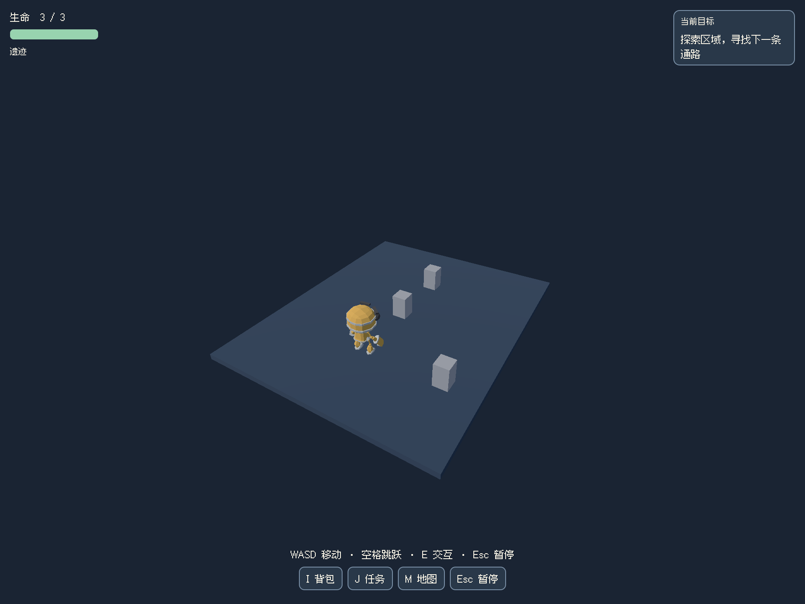

# 阶段 08 / 12：多区域自动装配与 UI 风格绑定

日期：2026-09-26。开发基线 `eb0f952`，本报告与实现同次提交，分支 `codex/stage-01-plan-selection`。平台为本机 macOS / Apple M5 Pro，Godot 4.7.1、Node 22.20、Electron 43.3 / Chromium 150。状态：本轮交互探索装配主流程开发者自验完成，待用户验收；完整生成游戏、参考美术与原阶段整体验收未完成。

对应原阶段 08-D01/D02 的装配、08-D04 的目标/结局/重试部分，以及 R09 的 UI 色板来源和阶段 12 的状态接入；未将 08-D03/D04 或 R09 整项勾选。用户已授权连续推进，人工验收仍独立保留。

## 本轮解决的问题

之前已有角色、任务、UI、存档组件，但每款游戏仍需重复编写连接代码。本轮新增可选 `game_assembly_v1.gd`，用 `data/game-assembly.json` 声明玩家场景、区域、真实任务节点、物理出口、显示名称及界面色板，组合已有运行组件。正式新工程模板和生成指引已接入；已有游戏不自动迁移。

- 任务与出口必须实际触发交互；背包、区域、任务列表、结局共享进度组件的同一份状态。缺少前置拒绝通行，钥匙按规则只扣一次，已完成物品不能重复领奖。
- 换区域先检查目标 PackedScene、出生点和节点类型，再替换场景和提交状态。目标场景缺失时保留原场景与未消费钥匙；玩家看到简明中文提示，节点详情留在诊断日志。
- 暂停冻结角色/区域，死亡可从检查点重试，继续游戏重建所在区域并恢复任务、奖励、已打开通路和生命。显式新游戏归档旧存档。损坏或不兼容存档保留，不偷偷重置进度。
- UI 色板有七个用途，绑定实际 ArtBible ID、文件 SHA 与色板；两组文字对比度最低 4.5。按钮焦点、悬停和按下状态使用相应文字颜色。未提供 palette 的旧组件保留原默认外观。
- 宿主在启动 Godot 前核对全部区域/目标/出口映射、路径与实际资源，保存带源码和文件 hash 的 `assembly-check.json`；缺失或不一致会终止发布，复用键包括校验器版本。

**色板和来源 hash 只证明配置与来源一致，不证明画面像参考图。** 本次工程没有接入用户章鱼参考图，未称其风格已还原，也没有给普通方块场景判定美术合格。

## 验证和证据

证据保存在 `.noobi-private/stage-08/`；本轮没有调用新生成任务，没有修改 A/B、章鱼云岛或《浮岛修复师》，没有购买或增加执行预算。

| 验证 | 实际结果 | 证据 |
|---|---|---|
| 宿主契约与正式构建拒绝 | 11 项通过，缺少绑定/低对比度/ArtBible 变化/资源缺失拒绝；坏装配未启动引擎、保留失败报告 | `gameAssembly.test.ts`、`godotBuilder.test.ts` |
| 独立 Godot 工程 | 31 项通过，包括真实物理移动与 Input 动作交互、区域门槛、重复奖励、坏出生点不扣钥匙、暂停、死亡/重试、坏档/版本不兼容与结局恢复 | `assembly/2026-09-26T02-18-19.950Z/report.json` |
| macOS 系统键盘 | 11 步通过；另一次新进程继续 2 步通过 | 同工程 `native-1790389108126/report.json`、`native-1790389154239/report.json` |
| 正式模板与导出 | 测过的 runtime SHA 与正式新工程一致；冻结构建、装配报告、Godot 导入/检查/运行/Web 导出通过 | `assembly-export/2026-09-26T02-19-16.865Z/result.json` |
| Chromium 实际鼠标键盘 | 11 步通过，从标题到三区域结局；保存后实际刷新页面，正确恢复遗迹检查点和通关状态 | 上述导出目录 `browser-1790389165308/report.json` |
| 全仓验证 | `npm run verify` 87 文件 / 708 测试通过，类型检查和生产构建通过 | `assembly-verify.log` |

正式构建 `648e5249-aa64-4491-be6f-0be7880108cf`；源码 SHA `dc805b4a0ee6c577b0b5ff850d2158244249158bac6b2f0c31e3c9e25d4699f3`；产物 SHA `1a372efa0817d28cb859b77d06ba609050cdfc97b17abb3b82b5471aa12b1c53`。

工程使用固定 SHA 的第三方 CC0 RobotExpressive 角色，来源、未修改 GLB 与额外工程 Fall/Hurt 姿态写入 `runtime-binding.json`；不是 Noobi 本轮自主生成的角色。系统键盘与浏览器探针只读状态，不调用完成任务、传送或获胜方法。第一组组件工程则明确使用 Godot Input 动作，并包含主动注入坏档、坏节点及致死伤害的负例，不将其称为全部真实用户输入。

## 本轮发现并保留的失败

1. 工程只读截图探针新增变量未标明 String，Godot 拒绝解析；已修正并重跑，旧失败保留在 `assembly/2026-09-26T02-09-03.402Z/`。脚本现在在导入阶段就检查解析错误。
2. 系统键盘帮助程序只接受整数毫秒，首次传入小数失败；随后锁门路线停在更靠近拾取物的位置，实际完成了拾取，不能判锁门验证通过。已修正工具参数和输入路线目标，未更改交互距离/任务门槛；失败保留在旧工程 `assembly/2026-09-26T02-10-18.626Z/` 下的 `native-1790388627183`、`native-1790388701853`。
3. 正式导入拒绝第三方无 UV 角色默认生成切线的错误；失败导出 `assembly-export/2026-09-26T02-11-43.149Z/`。成功导出仅为该无 UV、无 normal map 工程角色设置 `meshes/ensure_tangents=false`，不修改 GLB，不放宽正式引擎错误检查。原生前一轮可渲染不代表它已经通过正式发布检查。
4. 坏存档负例会产生一次 Godot `Parse JSON failed` 日志，这是故意输入损坏 JSON 的证据；不能将日志改称无错误。真实原生输入和浏览器路线没有该注入，也没有脚本运行错误。

## 支持边界与剩余开发

- 当前验证路线是短时三块工程区域，用来证明装配，不能替代三个有不同玩法的地区、两项真实探索能力、多种敌人、终局挑战及 30–60 分钟游戏。dash/glide 在此仅为进度权限，未冒充实际冲刺/滑翔动作。
- 存档为**区域检查点**，不保存任意当前位置、普通敌人血量或战斗中间状态；不兼容的规则需要明确迁移或保留旧档后新游戏。
- `defeat` 绑定已有实现与实际敌人类型检查，但本轮完整路线只验了 `interact`；击败类装配和不同战斗组合仍需专项实测。关键敌人必须在前置条件满足后才能遭遇，此版不自动复活提前击败但不能领奖的敌人。
- 区域内物理可达性、自然地形、角色脚底与相机、背景图/字体/材质/模型统一、参考相似度、跨区域音乐及音画同步、商店/对话/装备扩展继续待办。不能把 manifest 存在等同于制作质量达标。
- Chromium 刷新持久化不证明 Safari/Firefox、关闭浏览器后隔日恢复、新电脑或真人体验。多作品基准仍为 **0/30**，A/B 仍停止未交付。
- 本轮未改工作台，未重跑工作台截图；游戏 UI 的实际原生/浏览器操作与截图已验证。原有 30 分钟工程长测、音频整套与骨骼整套未重复执行。

## 用户验收入口与步骤

需本机 Godot 与匹配 Web 导出模板，以及 `.noobi-private/stage-07/skeletal-source/RobotExpressive.glb` 中此前固定 SHA 的 CC0 工程素材；脚本会核验其字节，不会调用模型服务。

在该工作分支安装依赖后，执行 `npm run build:main`、`node scripts/game-assembly-smoke.mjs` 可重建工程验证。已有工程路径由 `.noobi-private/stage-08/assembly-latest.json` 索引；用 Godot 打开该目录并传 `-- --noobi-assembly-demo` 可手动游玩。正式 Web 构建由 `assembly-export-latest.json` 索引；可运行 `electron scripts/game-assembly-browser-smoke.mjs` 复核冻结导出。

1. 标题选“开始新的冒险”；有旧工程档时明确确认新游戏。
2. WASD 移动、E 交互。先去出口应拒绝；取目标后才可进入下一区域，奖励不能重复领取。
3. 在遗迹完成目标后 Esc 暂停并保存，返回标题再继续；应回到遗迹出生点，保留任务和物品。
4. 到峰顶完成目标，应显示结局；保存后重新启动继续，应恢复结局。
5. 用户验收结论尚未填写；美术与完整作品不在此短工程的通过结论内。

## 战斗与区域音频后续

2026-09-26 战斗/音频装配：击败任务增加前置/容量锁，HUD 优先可完成任务；跨区域音乐与实际命中/受伤/结局事件复用免费音频管理器。修复 Web 暂停恢复误开第二音乐声部。36 项工程、Chromium 13 个状态与 14 组输出采样、27 项音频和旧物理/无音频装配回归通过；87 文件 / 710 测试通过。工程守卫死亡美术、音画延迟、完整自主作品和真人验收仍未完成，0/30 不变。见 [后续报告](08-combat-audio-integration.md)。此前 defeat/区域选曲未验证的表述保留为历史状态。
