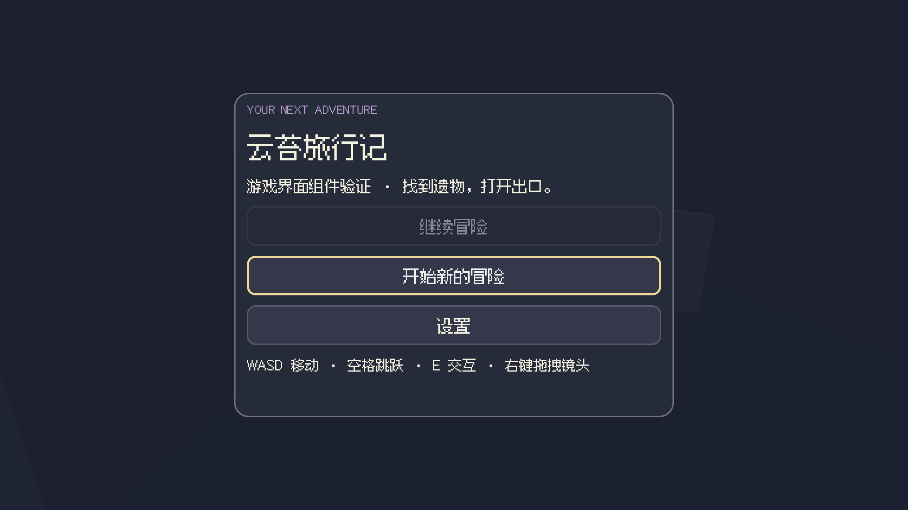
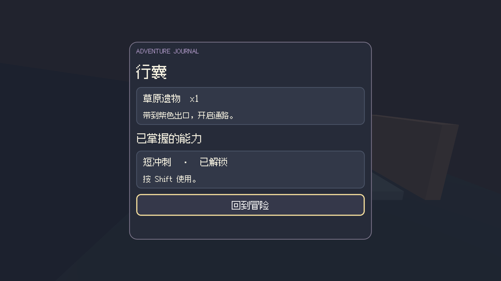
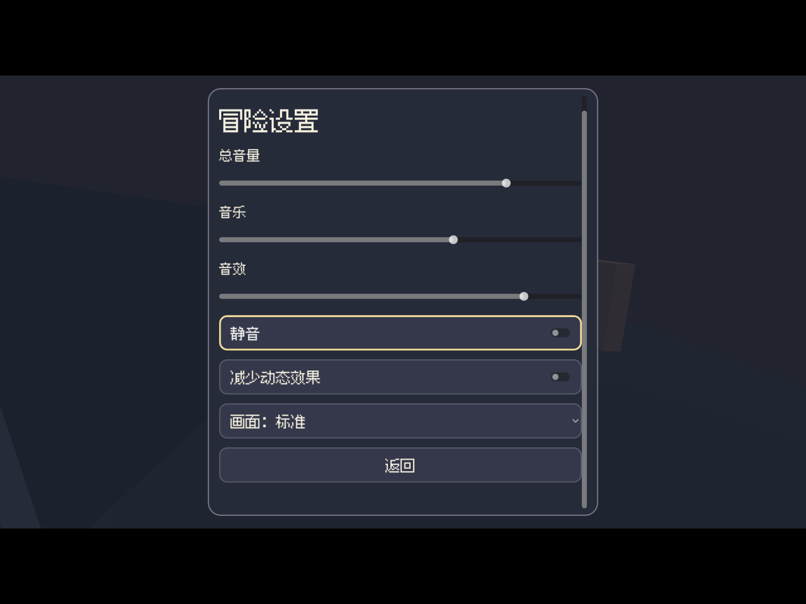

# 阶段 12 开发记录

2026-09-26：通用 UI 组件开发者自验完成；自主生成作品接入与用户验收仍未完成。

## 实现

新 Godot 工程加入 `runtime/noobi/ui_v1.gd` 与 `GAME_UI_V1.md`。原生 CanvasLayer/Control 组成标题、继续、新游戏确认、状态 HUD、任务、背包/能力、区域列表地图、暂停、设置、失败重试和结局。由游戏提供 snapshot/command 回调，组件不制造物品、任务进度或胜利。菜单暂停世界，释放鼠标；I/J/M/Esc 与可点击按钮、键盘焦点和滚动均可用。

采用深蓝面板、浅奶油文字、可配置淡紫强调色、明确焦点描边；标题可挂接真实游戏背景。默认使用随工程携带的 OFL 中文字体，许可和来源完整保留。减少动态偏好发信号给游戏适配；UI 本身无大幅动画。音乐/音效使用独立总线，0 音量显式静音，低档设置 3D 缩放，设置与游戏进度存档分离。

## 证据

- `npm run verify`：82 文件、656 测试，退出 0；`npm run smoke:ui` 退出 0，已检查实际工作台截图。
- `scripts/game-ui-build.mjs` 实际导入、运行并导出工程夹具。
- `scripts/game-ui-browser-smoke.mjs` 实际鼠标点击与按键：无存档继续禁用 → 新游戏 → 接近并拾取遗物 → 背包真实 x1 / 任务 / 地图 → 菜单中移动不生效 → 暂停保存 → 浏览器刷新继续仍 x1 → 走出地板跌落失败 → 从存档重试 → 接近出口交互胜利 → 返回标题/新游戏确认 → 新游戏计数归零 → 800×600 暂停/设置/恢复，全部通过。
- 构建 `5a34888c-1bd3-4c81-b101-01fcf8645672`；完整 source/artifact hash 位于 `.noobi-private/game-ui/runtime/2026-09-25T21-00-51.009Z/build.json`。
- 截图/逐步遥测：同目录 `browser-1790370058989/`。已看标题、HUD与小尺寸设置页，修正初版菜单过多留白。此场景用盒体/胶囊测试输入隔离，**不是美术样板或 Noobi 自主成品**。
- `scripts/game-ui-native-smoke.mjs`：真实 Godot 9 项组件行为、第二进程 4 项设置恢复通过；包括失败保存保留菜单与错误、实际 Master/Music/SFX 总线值及静音、viewport 0.75 缩放。初次因未导入工程字体失败，补上真实导入后通过，原日志保留。
- 初次浏览器路线未走到出口（停在 z=-2.5，出口 z=-5）失败；调整真实步行时长，未改判定距离或胜利条件后重跑通过。

## 边界

区域地图当前为真实区域状态列表，非空间小地图；装备槽/商店/对话等需按具体方案另配。主题可配置，尚不能据此宣称用户参考图的最终 UI 风格已经还原。独立生成样板 A/B 各自继续验收，不把手写夹具算作自主生成。完整成品接入、参考对照、持续游玩和人类体验未通过前，阶段不记已验收。

## 可查看的组件画面

这些是工程夹具中的实际运行截图，不是完整游戏美术验收。

## 原生独立包输入验证补充

阶段 10 已将此 UI 工程夹具导出为独立 macOS `.app`，完成实际原生渲染、14 步系统键盘流程，以及退出进程后重新启动继续读取进度。证据和边界见 [原生导出报告](10-delivery.md)。该结果属于 UI 工程组件的独立运行验证，未声称 Noobi 自主生成的 A/B 成品或任意风格界面已验收。

## 音频运行组件补充

新增播放管理器复用本组件的音乐/音效总线，保留已有音量、静音和设置持久化；提供音乐循环、切换渐变与暂停/重开清理。26 项原生工程检查及最终混音验证通过，见 [音频报告](07-audio-runtime.md)。本轮不改 UI 控件，不以工程 PCM 替代成品接入、浏览器出声或真人试听。

浏览器补充：将正式 UI 与音频组件接入独立工程，实际点击/键盘调整分轨，并验证最终输出，13 步通过；发现的 Web Sample 路由无声由音频组件改为 Stream 修复，UI 控件未重写。证据与延迟边界见 [音频报告](07-audio-runtime.md)。

2026-09-26 骨骼装配专项：真实 CC0 角色接入命名骨骼挂点、双脚只读探针、动作与延迟攻击；正式 UI 增加通关/失败存档 outcome 恢复。31 项骨骼工程、10 步 macOS 系统键盘与新进程继续 2 步通过，699 测试及构建通过。待机脚底仍约 -7.3mm（容差内），自然步态/IK/跨骨架复用、参考风格和自主成品未验收；基准仍 0/30。见 [本轮交付与用户验收](07-skeletal-integration.md)。

## 多区域装配补充

2026-09-26 交互探索装配：可选 manifest 连接实际玩家/区域、任务节点与出口、统一进度、原生 UI 色板和区域检查点。31 项工程、macOS 键盘 11 步与新进程 2 步、正式导出及 Chromium 11 步（包含刷新恢复）通过；87 文件 / 708 测试通过。色板绑定不等于参考图还原，defeat 完整路线、成品美术/音频和自主生成仍待验收，基准仍 0/30。见 [装配专项](08-game-assembly.md)。

## 战斗与区域音频后续

2026-09-26 战斗/音频装配：击败任务增加前置/容量锁，HUD 优先可完成任务；跨区域音乐与实际命中/受伤/结局事件复用免费音频管理器。修复 Web 暂停恢复误开第二音乐声部。36 项工程、Chromium 13 个状态与 14 组输出采样、27 项音频和旧物理/无音频装配回归通过；87 文件 / 710 测试通过。工程守卫死亡美术、音画延迟、完整自主作品和真人验收仍未完成，0/30 不变。见 [后续报告](08-combat-audio-integration.md)。此前 defeat/区域选曲未验证的表述保留为历史状态。
